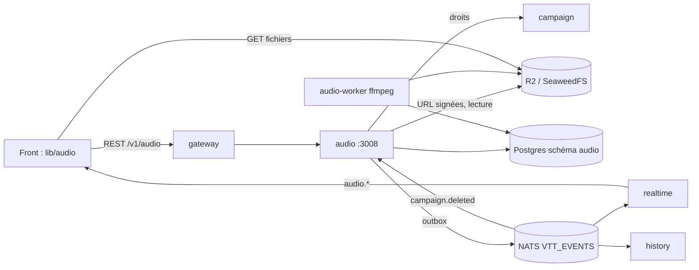

# Audio : audit du legacy et architecture cible

Sep 27, 2026 · étape 1 sur 2 (conception, sans code)

Le son devient un service à part, `backend/audio` (port 3008), avec un moteur audio unique côté
front (`frontend/src/lib/audio/`). On garde toutes les fonctionnalités vues par le MJ et les
joueurs, mais l'architecture est refaite : c'est l'exception à la règle « porter le legacy ». Ce
document sert de contrat aux deux lots d'implémentation (§ 7). La carte elle-même est hors
périmètre : pour les zones et les sons de token, on ne définit que l'interface dont le moteur a
besoin (§ 4.6).

Comptages : export local `~/vtt-export` du 27/09 (`sound_templates.ndjson`, `cartes.ndjson`,
`rtdb-rooms.json`, `Inventaire.ndjson`). À re-mesurer à l'import final.

## 1. Inventaire des fonctionnalités legacy

Chemins relatifs à `legacy/src/`. « MJ » : le meneur ; « joueur » : membre non MJ.

| Fonction                                                                                                                                                                        | Qui                                     | Stockage                                                                                                                                                                                          | Synchronisation                                                                                                       | Code                                                                                                                                  |
| ------------------------------------------------------------------------------------------------------------------------------------------------------------------------------- | --------------------------------------- | ------------------------------------------------------------------------------------------------------------------------------------------------------------------------------------------------- | --------------------------------------------------------------------------------------------------------------------- | ------------------------------------------------------------------------------------------------------------------------------------- |
| Bibliothèque de sons : ajout par fichier, par id YouTube ou depuis le catalogue, suppression (pas de modification), recherche floue, onglets Effets / Musique                   | MJ (chargée pour lui seul)              | Firestore `sound_templates/{salle}/templates/{id}` = `{ name, soundUrl, type: file\|youtube, category?: music\|sound, createdAt, duration? }` ; fichiers sur R2 `assets.yner.fr/sounds/{salle}/…` | `getDocs` une fois au montage, jamais relu (pas d'`onSnapshot`) : un 2ᵉ onglet MJ ne voit pas les ajouts              | `contexts/GMTemplatesContext.tsx`, `components/(personnages)/SoundDrawer.tsx`                                                         |
| Catalogue intégré : ~90 sons et musiques fantasy, 20 Star Wars (choisi par `gameSystem.objectLibraryId`), préécoute                                                             | MJ                                      | constantes du front, URL `assets.yner.fr/Audio`, `/Musics` et chemins relatifs `/effects/…`                                                                                                       | —                                                                                                                     | `lib/suggested-sounds*.ts`                                                                                                            |
| Envoi d'un son                                                                                                                                                                  | MJ                                      | `POST /api/upload-sound` → R2 (bibliothèque) ; Firebase Storage `audio / {salle}/…` (zones, tokens)                                                                                               | —                                                                                                                     | `app/api/upload-sound/route.ts`, `components/(map)/MapDialogs.tsx:497`                                                                |
| Playlists : créer, renommer, ajouter ou retirer une piste, supprimer ; vue « Tout »                                                                                             | MJ                                      | `sound_templates/{salle}/playlists/{id}` = `{ name, trackIds, createdAt }` ; supprimer un son laisse son id dans les playlists                                                                    | écriture optimiste locale, pas d'écoute                                                                               | idem                                                                                                                                  |
| Musique de fond : lecture, pause, précédent, suivant (en boucle sur la playlist), titre affiché aux joueurs ; bouton de la barre d'outils (raccourci configurable)              | MJ commande, tous écoutent              | RTDB `rooms/{salle}/music` = `{ videoId, templateId, videoTitle, isPlaying, timestamp, lastUpdate, updatedBy, type }`                                                                             | `onValue` dans 4 composants ; le client MJ réécrit `timestamp` toutes les 4 s ; seek chez les autres si écart > 1,5 s | `components/(music)/*`, `app/[roomid]/map/layout.tsx:191-199`, `page.tsx:2870`                                                        |
| Aléatoire, répéter, barre de progression                                                                                                                                        | MJ                                      | —                                                                                                                                                                                                 | boutons sans action, barre figée à `w-1/3`, pas d'enchaînement en fin de piste                                        | `SoundDrawer.tsx:900,924,943`                                                                                                         |
| Effet ponctuel global : clic = joué chez tous, re-clic = arrêt ; mode « Local (preview) »                                                                                       | MJ                                      | Firestore `global_sounds/{salle}` = `{ soundUrl, soundId, timestamp, type }` (un seul document)                                                                                                   | `onSnapshot` ; fenêtre de fraîcheur sur l'horloge du client                                                           | `SoundDrawer.tsx:115-170,282-330`, `hooks/map/useMapData.ts:152-181`, `components/(music)/YouTubeSFXPlayer.tsx`                       |
| Son d'arme : une arme référence un son, joué à l'attaque ou à la touche                                                                                                         | joueur attaquant et MJ                  | `Inventaire/{salle}/{perso}/{objet}.soundId` → `global_sounds`                                                                                                                                    | idem effet global                                                                                                     | `components/(combat)/combat.tsx:476,685-722`                                                                                          |
| Zones musicales : poser (outil ou glisser un son sur la carte), déplacer, redimensionner, renommer, volume, rayon, supprimer, préécoute, multi-sélection ; dessinées pour le MJ | MJ édite, chacun entend selon son token | `cartes/{salle}/musicZones/{id}` = `{ x, y, radius, url, name, volume, cityId }` (URL recopiée, pas l'id du son)                                                                                  | `onSnapshot` par scène ; lecture locale, non synchronisée entre joueurs                                               | `hooks/map/useAudioZones.ts`, `useMusicZoneActions.ts`, `useDragAndDrop.ts:242-268`, `components/(overlays)/MusicZoneContextMenu.tsx` |
| Spatialisation : volume `volume × (1 − (d/r)²)`, panoramique `clamp(dx / 0,6r)`, auditeur = token incarné (MJ : « vue joueur », sinon silence)                                  | tous                                    | —                                                                                                                                                                                                 | recalcul à chaque rendu du token                                                                                      | `useAudioZones.ts:165-256`, `page.tsx:984-1004`                                                                                       |
| Son de token (`token.audio` = `{ url, radius, volume, loop, name }`) : zone qui suit le token ; dialogue (catalogue, envoi, préécoute)                                          | MJ édite                                | champ du personnage Firestore ; `map_tokens.audio` dans campaign                                                                                                                                  | comme une zone (`char-{id}`) ; `loop` enregistré mais ignoré                                                          | `components/(dialogs)/CharacterAudioDialog.tsx`                                                                                       |
| Mixeur personnel : effets, zones, musique, dés ; couper, réinitialiser ; raccourci Q ; remplaçable par un thème ou un bundle                                                    | chacun                                  | `localStorage.audioMixerVolumes` + `CustomEvent('audioMixerVolumeChange')`, lu en 3 endroits                                                                                                      | par appareil                                                                                                          | `components/(audio)/AudioMixerPanel.tsx`, `modules/builtin/dnd-classic/mixer.tsx`, `app/[roomid]/map/audio-mixer-store.ts`            |
| Sons des dés : impact synthétisé, ambiances de skins (`/sons/*.mp3`) ; préférence « son » (service dice) ; réglage « sons thématiques »                                         | chacun                                  | fichiers statiques du front ; `dice.preferences.sound`                                                                                                                                            | local                                                                                                                 | `components/(dices)/audio.ts`, `contexts/SettingsContext.tsx`                                                                         |
| Autoplay : relance des `play()` bloqués au premier geste                                                                                                                        | tous                                    | —                                                                                                                                                                                                 | —                                                                                                                     | `utils/audioAutoplay.ts`                                                                                                              |
| Bibliothèque de fichiers : liste des sons envoyés avec leur taille                                                                                                              | MJ                                      | lit `sound_templates`                                                                                                                                                                             | —                                                                                                                     | `components/(infos)/FileLibrary.tsx:562`                                                                                              |
| Hors périmètre : widget de démonstration de la page d'accueil (lecture locale) ; `useBackgroundAudio` et `FloatingMusic`, morts depuis `cfde06de`                               | —                                       | —                                                                                                                                                                                                 | —                                                                                                                     | `components/blocks/ambiance-widget.tsx`                                                                                               |

Données (export du 27/09) :

| Source                        | Volume                                                                                                                                                                              |
| ----------------------------- | ----------------------------------------------------------------------------------------------------------------------------------------------------------------------------------- |
| `sound_templates/*/templates` | 35 dans 3 salles : 25 YouTube (22 musiques dont un id suivi d'une tabulation, 3 effets), 10 fichiers : 7 catalogue `/Audio` et `/effects`, 2 catalogue `/Musics`, 1 envoi `/sounds` |
| `sound_templates/*/playlists` | 3 playlists, 4 pistes, aucune orpheline                                                                                                                                             |
| RTDB `rooms/*/music`          | 3 salles, toutes en pause : 2 YouTube, 1 fichier `/Musics` ; champs de deux schémas mêlés (`trackUrl`, `trackName`, `loop`…)                                                        |
| `cartes/*/musicZones`         | 6 zones dans 2 salles : 4 fichiers du catalogue, 2 YouTube                                                                                                                          |
| `token.audio`                 | 0                                                                                                                                                                                   |
| `Inventaire` avec `soundId`   | 4, tous vers un son supprimé                                                                                                                                                        |
| Firebase Storage (sons)       | 0                                                                                                                                                                                   |

## 2. Causes racines des bugs

Preuves : commit ou `legacy/src/fichier:ligne`.

| #   | Cause racine                                                   | Preuve                                                                                                                                                                                                                                                                                                                                                                                                                                                                                                                                             | Parade                                                                                                                     |
| --- | -------------------------------------------------------------- | -------------------------------------------------------------------------------------------------------------------------------------------------------------------------------------------------------------------------------------------------------------------------------------------------------------------------------------------------------------------------------------------------------------------------------------------------------------------------------------------------------------------------------------------------- | -------------------------------------------------------------------------------------------------------------------------- |
| 1   | Pas d'horloge commune : `Date.now()` de navigateurs différents | `6428e84f` retire la compensation `Date.now() − lastUpdate` à cause des écarts : un joueur qui arrive démarre au `timestamp` écrit jusqu'à 4 s plus tôt. Effets jetés si l'horloge diffère de plus de 2 s (`useMapData.ts:171`) ou si l'auteur précédent était en avance (`SoundDrawer.tsx:133`, `YouTubeSFXPlayer.tsx:57`)                                                                                                                                                                                                                        | Le serveur est la seule horloge (`anchorAt`) ; chaque client estime son décalage (§ 3.7) et calcule la position localement |
| 2   | Le lecteur du MJ sert de référence                             | `MJMusicPlayer.tsx:197-225` publie sa position toutes les 4 s ; s'il bufferise, tout le monde recule (seek au-delà de 1,5 s, `PlayerMusicControl.tsx:200-205`) ; onglet fermé ou en arrière-plan : la référence se fige ; deux onglets MJ écrivent en concurrence                                                                                                                                                                                                                                                                                  | Machine à états serveur, sans écriture périodique ; position déduite de `(positionMs, anchorAt)`                           |
| 3   | Musique « fichier » jamais positionnée                         | `syncFileAudio` (`MJMusicPlayer.tsx:80-102`, `PlayerMusicControl.tsx:62-82`) n'applique jamais `timestamp` : chacun démarre à 0 ; `audio.src !== data.videoId` compare une URL absolue à la valeur brute : un chemin relatif recharge le fichier (retour à 0) à chaque mise à jour, toutes les 4 s                                                                                                                                                                                                                                                 | Positionnement par la ligne de temps ; source identifiée par `assetId`, URL absolue fournie par le serveur                 |
| 4   | Écritures concurrentes en lecture-modification-écriture        | Bascule `isPlaying: !musicState.isPlaying` depuis une copie locale (`SoundDrawer.tsx:339,932`, `page.tsx:2879`), reproduite par le portage qui réécrit tout l'objet (`frontend/…/play/map/map-view.tsx:3509-3514`) : deux clics s'annulent, la pause ne garde pas la position ; `global_sounds` est un seul document : deux effets rapprochés, le premier est perdu                                                                                                                                                                                | Commandes d'intention (`pause` et `resume` idempotentes), verrou de ligne et `version`, 409 ; un effet est un événement    |
| 5   | Événement ponctuel modélisé comme un état                      | `global_sounds` rejoue le dernier son au chargement ; `b84b3b38` et `97acecd9` empilent des heuristiques (premier instantané ignoré, fenêtre de 5 s, « Firestore can fire twice », `SoundDrawer.tsx:125`)                                                                                                                                                                                                                                                                                                                                          | `audio.cue_played` porte un `startAt` serveur ; joué seulement s'il a moins de 3 s, rejeu compris                          |
| 6   | État dupliqué, écouteurs multiples                             | Musique écoutée par 4 composants, 4 copies (`b322059f`, `8b00ac17`) ; `global_sounds` joué par `useMapData` (volume du mixeur) **et** par le `SoundDrawer` monté pour tous les membres (`MapDialogs.tsx:544`, volume fixe 0,5, coupé à 5 s), parfois une 3ᵉ fois (`UnifiedSearchDrawer.tsx:490`) : le son sort plusieurs fois et le mixeur ne le coupe pas ; mixeur relu en 3 copies (`AudioMixerPanel.tsx:15-64`, `dnd-classic/mixer.tsx`, `(dices)/audio.ts:15-24`) ; playlists passées de la RTDB à Firestore (`b322059f`), RTDB à deux schémas | Un magasin par campagne dans le moteur, un abonnement, un mixeur ; un propriétaire par donnée (§ 3.10)                     |
| 7   | Plusieurs AudioContext, nœuds jamais libérés                   | Contexte des dés (`(dices)/audio.ts:69`) et des zones (`useAudioZones.ts:21-48`), le reste en `new Audio()` hors graphe ; zone supprimée sans `disconnect()` (`useAudioZones.ts:80-83,110-114`) ; repli CORS hors graphe (`:136-143`) ; préécoutes jamais arrêtées (`SoundDrawer.tsx:206`, `CharacterAudioDialog.tsx:97`, `combat.tsx:738`) ; `gain.value =` à chaque rendu, d'où des clics (`:211-212`)                                                                                                                                           | Un contexte, voix en pool avec `dispose()` idempotent, automation des paramètres (§ 3.8)                                   |
| 8   | Autoplay traité au cas par cas                                 | `registerPendingPlay` relance `play()` depuis la position de l'élément (0), pas celle de la ligne de temps ; contexte déverrouillé à part (`useAudioZones.ts:30-37`) ; effets en simple `console.error` (`SoundDrawer.tsx:163`) ; utilisateur jamais prévenu                                                                                                                                                                                                                                                                                       | Un déverrouillage unique, bandeau « activer le son », position recalculée au déverrouillage                                |
| 9   | YouTube en lecteurs cachés                                     | Iframes 0×0 (`MJMusicPlayer.tsx:114-125`, `page.tsx:4144-4175`, `YouTubeSFXPlayer.tsx:87-99`), contraires aux règles de YouTube (200×200 px minimum, III.I.7 isolement de l'audio, III.I.9 lecteur non affiché) ; cross-origin : ni panoramique ni fondu ; remontage de `react-youtube` combattu par un `initialVideoId` figé et des drapeaux temporisés de 500 et 1 000 ms (`MJMusicPlayer.tsx:57-75,178`) ; `audioVolumes.globalSound` inexistant (`layout.tsx:197`) : effets YouTube toujours à 0,5                                             | Adaptateur isolé, lecteur visible, canal musique seulement (§ 3.9)                                                         |
| 10  | Fichiers sans chaîne de traitement                             | Deux chemins d'envoi : Firebase Storage avec des espaces dans le chemin (`MapDialogs.tsx:497`) et `/api/upload-sound` (ni authentification ni limite, extension crue, fichier en mémoire, détail des erreurs renvoyé) ; mp3 de 11 Mo commités (`2830630d`) puis passés sur R2 (`ee51c7c5`) ; durée et volume inconnus : pas d'enchaînement, niveaux disparates                                                                                                                                                                                     | URL signée, type réel vérifié, quotas, worker d'analyse (§ 3.4)                                                            |
| 11  | Références sans intégrité                                      | Une zone recopie l'URL (`useDragAndDrop.ts:256-266`) ; les playlists gardent les ids de sons supprimés ; 4 armes sur 4 pointent vers un son supprimé                                                                                                                                                                                                                                                                                                                                                                                               | Références par `assetId`, suppression logique, cascade sur les playlists, « son introuvable » affiché                      |
| 12  | Fonctions affichées mais inertes                               | Aléatoire, répéter et barre de progression sans effet (`SoundDrawer.tsx:900-943`) ; `isMusicLayerVisible` forcé à `true` (`page.tsx:1004`) malgré le commentaire (`:975-977`)                                                                                                                                                                                                                                                                                                                                                                      | Répétition, aléatoire et enchaînement gérés par le serveur ; progression calculée par `positionAt`                         |

## 3. Architecture cible



### 3.1 Service `backend/audio`

Il couvre la bibliothèque d'assets, les playlists, l'état des canaux, les effets ponctuels, le
mixeur personnel, le catalogue et l'horloge ; il ne connaît ni la carte ni les personnages.
Service identique aux autres : `createService()` de `@vtt/platform`, Zod 4, Drizzle, Liquibase
appliqué par `audio_owner`, connexion en `audio_svc`, outbox et relais `audio_outbox`,
garde-fou `src/event-guard.test.ts`, chart `infra/helm/service`. Droits demandés à campaign :
`GET /internal/campaigns/:id/rights?userId=` (secret partagé, cache de 5 s) ; campaign en panne :
503, aucun droit ouvert (comme dice).

Configuration : `PORT` (3008), `DATABASE_URL`, `DATABASE_DIRECT_URL`, `NATS_URL`,
`JWT_ISSUER`, `JWT_AUDIENCE`, `JWKS_URL`, `INTERNAL_API_SECRET`, `CAMPAIGN_URL`, `S3_*` (comme
campaign), `AUDIO_UPLOAD_SECRET` (≥ 32 caractères, signe les jetons d'envoi),
`AUDIO_CATALOG_ORIGINS` (`https://assets.yner.fr`), `AUDIO_MAX_BYTES_LONG` (100 Mo, musique et
ambiance), `AUDIO_MAX_BYTES_SFX` (20 Mo), `AUDIO_CAMPAIGN_QUOTA_BYTES` (2 Gio),
`AUDIO_LOUDNESS_TARGET_LUFS` (−16), `SCHEDULER_INTERVAL_MS` (500),
`CUE_RATE_PER_USER` (10 par 10 s). Horloge : `Date.now()` du réplica (nœuds synchronisés par
chrony, quelques ms d'écart). Consommateur durable `audio-campaigns` (`vtt.*.campaign.deleted`,
`inbox`) : suppression logique des assets, playlists et canaux, purge des fichiers planifiée.

### 3.2 Modèle de données (schéma `audio`)

```sql
CREATE TABLE assets (
  id             uuid        PRIMARY KEY,            -- uuidv7 ; import : importedAssetId()
  campaign_id    uuid        NOT NULL,
  kind           text        NOT NULL CHECK (kind IN ('music', 'ambience', 'sfx')),
  name           text        NOT NULL CHECK (char_length(name) BETWEEN 1 AND 200),
  source         text        NOT NULL CHECK (source IN ('upload', 'catalog', 'youtube')),
  status         text        NOT NULL CHECK (status IN ('processing', 'ready', 'rejected')),
  catalog_id     text, original_key text,            -- selon la source ; original_key : clé S3
  youtube_id     text CHECK (youtube_id ~ '^[A-Za-z0-9_-]{11}$'),
  playback_url   text,                               -- URL absolue servie (null si youtube ou pas prête)
  mime_type      text, size_bytes bigint, codec text, sample_rate int, channels smallint,
  bitrate        int, duration_ms int CHECK (duration_ms > 0),
  loudness_lufs  real, true_peak_dbtp real,
  gain_db        real        NOT NULL DEFAULT 0 CHECK (gain_db BETWEEN -24 AND 12), -- normalisation
  volume         real        NOT NULL DEFAULT 1 CHECK (volume BETWEEN 0 AND 1),     -- réglage MJ
  reject_reason  text, created_by uuid,              -- created_by null : import
  version int NOT NULL DEFAULT 1, created_at timestamptz NOT NULL DEFAULT now(),
  updated_at timestamptz NOT NULL DEFAULT now(), deleted_at timestamptz,
  CONSTRAINT assets_source_fields CHECK (
    (source = 'youtube') = (youtube_id IS NOT NULL) AND
    (source = 'catalog') = (catalog_id IS NOT NULL) AND
    (source = 'upload')  = (original_key IS NOT NULL))
);
CREATE INDEX assets_campaign ON assets (campaign_id, kind, name) WHERE deleted_at IS NULL;

CREATE TABLE playlists (
  id uuid PRIMARY KEY, campaign_id uuid NOT NULL, created_by uuid, version int NOT NULL DEFAULT 1,
  name text NOT NULL CHECK (char_length(name) BETWEEN 1 AND 100),
  created_at timestamptz NOT NULL DEFAULT now(), updated_at timestamptz NOT NULL DEFAULT now()
);
CREATE TABLE playlist_items (
  playlist_id uuid NOT NULL REFERENCES playlists (id) ON DELETE CASCADE,
  asset_id    uuid NOT NULL REFERENCES assets (id) ON DELETE CASCADE,
  position    int  NOT NULL, PRIMARY KEY (playlist_id, asset_id),
  UNIQUE (playlist_id, position) DEFERRABLE INITIALLY DEFERRED
);

CREATE TABLE channels (                              -- état de lecture qui fait autorité
  campaign_id  uuid   NOT NULL, channel text NOT NULL CHECK (channel IN ('music', 'ambience')),
  version      bigint NOT NULL DEFAULT 0,            -- +1 à chaque changement effectif
  status       text   NOT NULL DEFAULT 'stopped' CHECK (status IN ('stopped', 'playing', 'paused')),
  asset_id     uuid   REFERENCES assets (id) ON DELETE SET NULL, -- piste courante
  playlist_id  uuid   REFERENCES playlists (id) ON DELETE SET NULL,
  queue        uuid[] NOT NULL DEFAULT '{}', queue_index int, -- ordre de lecture figé (aléatoire compris)
  repeat       text   NOT NULL DEFAULT 'all' CHECK (repeat IN ('off', 'track', 'all')), -- ambience : 'track'
  shuffle      boolean NOT NULL DEFAULT false,
  position_ms  bigint NOT NULL DEFAULT 0 CHECK (position_ms >= 0), -- position à anchor_at
  anchor_at    timestamptz NOT NULL DEFAULT now(),
  ends_at      timestamptz,                          -- prochaine transition automatique
  volume       real   NOT NULL DEFAULT 1 CHECK (volume BETWEEN 0 AND 1),
  crossfade_ms int    NOT NULL DEFAULT 1500 CHECK (crossfade_ms BETWEEN 0 AND 10000),
  updated_by   uuid, updated_at timestamptz NOT NULL DEFAULT now(), PRIMARY KEY (campaign_id, channel)
);
CREATE INDEX channels_due ON channels (ends_at) WHERE status = 'playing' AND ends_at IS NOT NULL;

CREATE TABLE cues (                                  -- effets lancés : arrêt, débit, audit court
  id uuid PRIMARY KEY, campaign_id uuid NOT NULL, asset_id uuid NOT NULL REFERENCES assets (id),
  started_by uuid NOT NULL, start_at timestamptz NOT NULL, stopped_at timestamptz
);
CREATE INDEX cues_user_recent ON cues (started_by, start_at DESC);  -- purgées après 24 h

CREATE TABLE mixer_preferences (                     -- décision Q3
  user_id uuid PRIMARY KEY, volumes jsonb NOT NULL CHECK (jsonb_typeof(volumes) = 'object'),
  muted   jsonb NOT NULL DEFAULT '{}' CHECK (jsonb_typeof(muted) = 'object'),
  version int NOT NULL DEFAULT 1, updated_at timestamptz NOT NULL DEFAULT now()
);

CREATE TABLE jobs (                                  -- file du worker (SKIP LOCKED)
  id uuid PRIMARY KEY, asset_id uuid REFERENCES assets (id) ON DELETE CASCADE,
  kind text NOT NULL CHECK (kind IN ('analyze', 'purge')),
  status text NOT NULL DEFAULT 'pending' CHECK (status IN ('pending', 'running', 'done', 'failed')),
  attempts int NOT NULL DEFAULT 0, run_after timestamptz NOT NULL DEFAULT now(),
  locked_until timestamptz, last_error text, created_at timestamptz NOT NULL DEFAULT now()
);
CREATE INDEX jobs_due ON jobs (run_after) WHERE status IN ('pending', 'running');

CREATE TABLE legacy_ids (source text NOT NULL, legacy_id text NOT NULL,
  target_type text NOT NULL, target_id uuid NOT NULL, PRIMARY KEY (source, legacy_id));
-- outbox + inbox : gabarit infra/postgres/templates/outbox.sql (canal audio_outbox), plus un
-- trigger NOTIFY 'audio_jobs' sur jobs pour réveiller le worker
```

### 3.3 Canaux, effets, bus

| Notion           | Nature                                                | Exemples                              |
| ---------------- | ----------------------------------------------------- | ------------------------------------- |
| Canal `music`    | état persistant, une piste, playlist                  | musique de fond (legacy)              |
| Canal `ambience` | état persistant, une piste en boucle                  | pluie, taverne (nouveau, décision Q6) |
| Effet (`cue`)    | événement ponctuel, superposable                      | effet global, son d'arme              |
| Source spatiale  | calculée localement depuis la carte                   | zone musicale, son de token           |
| Bus du mixeur    | `master`, `music`, `ambience`, `sfx`, `zones`, `dice` | réglage personnel de chacun           |

### 3.4 Fichiers : envoi, validation, worker

1. `POST …/assets/uploads` : type déclaré, taille (limite du `kind`) et quota de la campagne
   vérifiés. Réponse : URL PUT signée 5 min vers `audio/incoming/<campaignId>/<assetId>` (type
   et longueur signés, comme `campaign/src/storage/images.ts`, mais avec son propre signataire :
   celui de campaign n'accepte que des images) et `uploadToken`, HMAC de
   `{ assetId, campaignId, key, size, contentType, kind, exp }`. Rien n'est écrit en base
   (exception du garde-fou). Le navigateur envoie ensuite le fichier directement au stockage.
2. `POST …/assets { source: 'upload', uploadToken, name, kind }` : jeton vérifié, `HEAD` de
   l'objet (taille exacte), lecture des 4 premiers Kio pour vérifier le type réel (signatures
   ID3 ou trame MPEG, `ftyp` M4A, `OggS`, `RIFF…WAVE`, `fLaC`, EBML), sinon 415. L'asset est créé
   en `processing`, avec un job `analyze` et `audio.asset_created`, dans une transaction.
3. Le worker (`audio-worker`, même paquet, entrée `worker.js`, image avec ffmpeg épinglé) :
   - `ffprobe` : un seul flux audio, codec, durée ≤ 60 min (effets ≤ 10 min) ;
   - `ebur128` : loudness intégrée et true peak ; `gain_db = clamp(cible − I, −12, +6)`, borné
     pour que le true peak résultant reste ≤ −1 dBTP ; la normalisation s'applique à la lecture,
     jamais au fichier ;
   - transcodage seulement si le codec n'est ni MP3 ni AAC, ou au-delà de 320 kb/s : AAC-LC
     192 kb/s en M4A `+faststart` (formats lus partout, Safari compris) ;
   - copie vers `audio/assets/<campaignId>/<assetId>/playback.<ext>` et `original.<ext>`, puis
     `ready` et `audio.asset_ready`, ou `rejected` avec le motif et `audio.asset_rejected` ;
   - 3 tentatives avec attente croissante ; `readOnlyRootFilesystem`, `/tmp` en `emptyDir` de
     1 Gio, un réplica, deux jobs à la fois.
4. `audio/incoming/` expire après 24 h (règle de cycle de vie R2 ; en local, purge par le
   worker). Un asset supprimé est effacé logiquement (`deleted_at`) : il sort des playlists
   dans la même transaction, et ses fichiers sont purgés 30 jours plus tard (job `purge`).

Formats à l'envoi, comme le legacy : mp3, m4a/aac, ogg, opus/webm, wav, flac. Catalogue :
entrées déclarées par le serveur (`backend/audio/src/catalog/`, reprises de
`frontend/src/lib/suggested-sounds.ts` et de la variante Star Wars), sans copie, origines
limitées à `AUDIO_CATALOG_ORIGINS` ; `assets.yner.fr` (89 entrées) répond déjà en CORS `*` avec
Range. Les 20 sons Star Wars sont des wav servis par le legacy (`/effects/Star Wars/`, 26 Mo),
absents du nouveau front : `scripts/publish-catalog.ts` les transcode et les publie une fois dans
`audio/catalog/` du bucket, et toutes les URL du catalogue deviennent absolues. `analyze` relève
durée et loudness. YouTube : `ready` tout de suite, `durationMs` fourni par le
navigateur du MJ s'il la connaît. Prérequis : CORS GET du bucket S3 pour les origines du site
(Web Audio impose `crossOrigin="anonymous"`).

### 3.5 Machine à états d'un canal

États : `stopped`, `playing`, `paused`. Toute commande passe par une transaction :
`INSERT … ON CONFLICT DO NOTHING` (ligne créée à la demande), puis `SELECT … FOR UPDATE`. Si
`expectedVersion` est fourni et diffère, la réponse est 409 `version_conflict` avec l'état courant.
Sinon, application de la fonction pure `applyCommand(state, command, nowMs, assets)`. Si rien
ne change, 200 sans événement (idempotence) ; sinon `version + 1`, mise à jour, un
`audio.channel_changed` dans l'outbox, commit.

| Commande                      | Effet                                                                                                            |
| ----------------------------- | ---------------------------------------------------------------------------------------------------------------- |
| `play { assetId }`            | piste seule, `queue = [assetId]`, `positionMs` (0 par défaut), `playing`                                         |
| `play { playlistId, index? }` | `queue` = pistes de la playlist (mélangées si `shuffle`, piste choisie en tête), `playing`                       |
| `pause`                       | `positionMs = positionAt(now)`, `paused`, `endsAt = null` ; sans effet si déjà en pause ou arrêté                |
| `resume`                      | `anchorAt = now`, `playing` ; sans effet si déjà en lecture ; 409 `no_track` sans piste                          |
| `seek { positionMs }`         | nouvelle ancre, même état                                                                                        |
| `stop`                        | `stopped`, position 0, piste et file gardées                                                                     |
| `next`, `previous`            | piste voisine de la file, avec retour au début ou à la fin comme le legacy ; position 0 ; `playing` si on jouait |
| `configure`                   | `volume`, `crossfadeMs`, `repeat`, `shuffle` (mélange ou rétablit l'ordre, la piste courante reste en place)     |

Règles :

- `endsAt = anchorAt + durée − positionMs − fondu` : si une suivante existe et que le fondu est
  non nul, elle commence `crossfadeMs` avant la fin. `null` si `repeat = 'track'`, si la durée
  est inconnue ou hors lecture.
- Enchaînement : chaque réplica exécute toutes les 500 ms
  `SELECT … WHERE status = 'playing' AND ends_at <= now FOR UPDATE SKIP LOCKED LIMIT 50`, sans
  élection de chef. La nouvelle ancre vaut exactement l'ancien `ends_at`, et non l'heure du
  traitement : la ligne de temps prédite par les clients reste juste. `repeat = 'off'` après la
  dernière piste : `stopped`. Après une panne, rattrapage en une seule transition
  (`advanceUntil(now)`, 100 pas au plus), avec `skipped` dans le payload.
- Musique YouTube sans durée : pas d'`endsAt`. Le client MJ envoie `next` avec
  `expectedVersion` à la fin de la vidéo ; deux onglets ne font pas sauter deux pistes.
- Asset supprimé pendant sa lecture : passage à la suivante ou arrêt (`cause: 'asset_deleted'`).
  Playlist modifiée : la file est recalculée autour de la piste courante.

### 3.6 Effets ponctuels

`POST …/cues { cueId, assetId, volume? }` (`cueId` : uuidv7 choisi par le client, qui sert aussi
de clé d'idempotence) crée une ligne `cues` et
`audio.cue_played { cueId, asset, startAt, volume, startedBy }` (public). Un client le joue
si `serverNow − startAt ≤ 3 000 ms`, depuis le début ; sinon il l'ignore (rejeu après
reconnexion, onglet endormi). Le client qui lance joue tout de suite et ignore son propre écho
(même `cueId`). Les effets se superposent (16 voix au plus, la plus ancienne est volée).
Arrêt : `POST …/cues/:cueId/stop` (MJ ou auteur) et `POST …/cues/stop` (MJ, tous) →
`audio.cues_stopped { cueIds | all }`. YouTube refusé (422 `youtube_not_allowed`).

### 3.7 Synchronisation entre clients

- **Horloge.** `GET /v1/audio/clock` renvoie `{ serverTime }`. Le client mesure `t0` et `t1` avec
  `performance.timeOrigin + performance.now()` (monotone, insensible aux changements d'heure
  système) et calcule `offset = serverTime − (t0 + t1) / 2`. Il prend 5 échantillons à 200 ms
  d'intervalle et garde celui de plus petit aller-retour. Nouvel échantillonnage toutes les 5 min,
  au retour de visibilité et à la reconnexion ; `serverTime` de `GET …/channels` sert
  d'estimation grossière en attendant. Précision attendue : moins de 20 ms, bien en deçà de ce
  qu'entendent des joueurs à distance.
- **Position.** `positionAt(state, serverNow())` (§ 4.2), même fonction côté serveur et client.
- **Arrivée en cours de morceau, rechargement.** `GET …/channels`, puis lecture à la position
  calculée. Abonnement `audio.*` ; un état n'est appliqué que si `version` est supérieure à celle
  connue. La réponse REST d'une commande porte déjà la nouvelle version : l'écho est ignoré.
- **Reconnexion.** Le client realtime reprend avec son dernier `seq`. Les événements rejoués
  passent par le même filtre de version. Si `generation` change (`resync`), on relit en REST.
  Coupé du réseau, un canal continue localement : sa ligne de temps est déterministe.
- **Pause et seek.** La position vient du serveur : chaque client se cale au même endroit, avec
  un fondu de 150 ms (pause) ou de 60 ms (seek).
- **Dérive.** Chaque seconde de lecture, puis à l'événement `playing` après une mise en mémoire
  tampon : `driftAction(attendu, réel)`. Jusqu'à 50 ms, rien ; jusqu'à 300 ms, `playbackRate`
  de 0,98 ou 1,02 (`preservesPitch`) jusqu'au rattrapage ; au-delà, seek. La ligne de temps fait
  foi : un client qui a bufferisé saute en avant, il ne ralentit pas les autres.
- **Fin de piste.** Le client connaît `next` et `endsAt` : il précharge la suivante 20 s avant,
  la démarre à l'heure prévue avec le fondu, puis l'événement du serveur confirme sans rien
  changer.
- **Canal éphémère : non utilisé.** Chaque changement sonore doit être autorisé, ordonné,
  versionné et rejouable. Le chemin durable (outbox → NATS → realtime) prend moins de 200 ms,
  ce qui suffit, et l'effet porte son `startAt` serveur. Le type éphémère `sound.global` du
  portage est retiré.

### 3.8 Moteur audio du front

```
voix ─► gain de voix (fondu × volume asset × 10^(gainDb/20) × volume canal) ─► [StereoPanner : spatial]
     ─► bus (music | ambience | sfx | zones | dice | preview) ─► master ─► limiteur (DynamicsCompressor, −1 dBFS) ─► destination
YouTube (iframe) : hors graphe, setVolume(mixer.music × mixer.master × volume canal × 100)
```

- **Un seul `AudioContext`**, créé à la première demande, singleton hors React
  (`useSyncExternalStore`). Les dés s'y branchent : `(dices)/audio.ts` prend `engine.context` et
  `engine.bus('dice')` ; les sons eux-mêmes ne changent pas.
- **Voix.** `MediaVoice` : `HTMLAudioElement` en pool (16 au plus), `crossOrigin="anonymous"`,
  une `MediaElementAudioSourceNode` créée une seule fois par élément puis réutilisée en changeant
  `src` ; pour la musique, l'ambiance, les zones et les effets de plus de 30 s. `BufferVoice` :
  `AudioBufferSourceNode` depuis le cache, pour les effets de 30 s au plus (latence minimale,
  superposition possible). `ExternalVoice` : lecteur YouTube.
- **Nettoyage garanti.** `dispose()` est idempotent : arrêt, `disconnect()` de tous les nœuds,
  `removeAttribute('src')` + `load()` pour libérer le décodeur, retour au pool. Le registre des
  voix est vidé par `detachCampaign()`. Un compteur de nœuds vivants sert aux tests.
- **Fondus.** `cancelScheduledValues`, `setValueAtTime(courant)`, `linearRampToValueAtTime` ;
  paramètres spatiaux par `setTargetAtTime(v, t, 0,05)`, jamais `.value =`.
- **Préchargement et cache.** Cache LRU des `AudioBuffer` décodés (64 Mo de PCM estimé) ; les
  effets résolus (bibliothèque du MJ, sons d'armes) sont préchargés. La piste `next` passe en
  `preload="auto"` 20 s avant `endsAt`.
- **Autoplay.** Un seul déverrouillage, sur le premier `pointerdown`, `keydown` ou `touchend`
  (capture) : `ctx.resume()`. L'état `locked` ou `running` est exposé ; l'état `interrupted`
  d'iOS est traité comme `locked`. Si quelque chose devrait s'entendre (canal en lecture, zone
  active, effet reçu), `AudioUnlockBanner` s'affiche. Au déverrouillage, chaque canal repart à
  la position de la ligne de temps.
- **Spatialisation.** `zoneMix` reprend les courbes du legacy : volume
  `volume × (1 − (d/r)²)`, panoramique `clamp(dx / 0,6r)`. Position de l'auditeur rafraîchie à
  chaque image (`requestAnimationFrame`). 8 sources actives au plus (les plus fortes) ; une voix
  est libérée après 10 s à volume nul. Boucle déterministe (`serverNow mod durée`) : deux joueurs
  dans la même taverne entendent le même passage.
- **Mixeur.** Volumes et coupures par bus, persistés selon la décision Q3. Le bus `dice` est
  en plus multiplié par la préférence `sound` du service dice
  (`engine.setBusEnabled('dice', …)`). Le remplacement du panneau par un thème ou un bundle
  (`audio-mixer-store.ts`) est conservé ; il lit `useMixer()`.

### 3.9 YouTube

Jamais de téléchargement ni d'extraction de l'audio : c'est contraire aux règles de YouTube
(III.E.1.a, III.I.7). Recommandation (décision Q1) : **mode lecteur externe**.

- Source admise seulement dans le canal `music`. Refusée dans l'ambiance, les effets, les zones
  et les sons de token : 422 `youtube_not_allowed`.
- Lecteur IFrame visible d'au moins 200×200 px (`YouTubeMiniPlayer`, repliable en vignette de
  200×200 mais jamais masqué), `allow="autoplay"`, hôte `youtube-nocookie.com`.
- Synchronisation approximative : seek au-delà de 2 s d'écart. Publicités, mise en mémoire
  tampon et vidéos non intégrables échappent à notre contrôle (« YouTube indisponible » affiché).
- Ni panoramique, ni fondu, ni limiteur (iframe cross-origin) : seul le volume suit le mixeur.

Alternative : abandon ; les assets YouTube importés sont marqués « à remplacer ».

### 3.10 Propriété des données

- **Zones musicales : une couche de la carte (campaign)** qui référence un `assetId`. Géométrie,
  scène, rayon et volume vivent avec la carte : requêtes PostGIS `at`, cascade à la suppression
  d'une carte, visibilité, édition dans les outils de carte. Le fichier et ses métadonnées
  (durée, gain, URL) appartiennent à audio. Pas de clé étrangère entre schémas : un id inconnu
  ou supprimé s'affiche « son introuvable ».
- **`token.audio`** : même principe, `{ assetId, radius, volume, name }` sur le token. `loop` est
  gardé pour compatibilité mais reste ignoré, comme dans le legacy.
- **Son d'arme** : `soundAssetId` sur l'objet d'inventaire (character) ; le combat appelle
  `useSoundCues().play(soundAssetId)`. Les 4 références legacy sont orphelines : rien à migrer.
- **Dés** : fichiers statiques du front (`frontend/public/sons`) et synthèse locale, sur le bus
  `dice` du moteur ; rien dans audio.
- **Musique de la carte** : `map_settings.music` (campaign) est remplacé par le canal `music`.
  Le front cesse de l'écrire ; la colonne sera retirée lors de la refonte de la carte.

Ces changements de campaign et de character sont hors lots (§ 7) ; en attendant, le moteur
accepte une URL à la place d'un `assetId` (§ 4.6).

## 4. Contrats

### 4.1 Routes REST (gateway : `'/v1/audio': 'UPSTREAM_AUDIO_URL'`)

Mêmes conventions que les autres services : jeton obligatoire, JSON camelCase, erreurs
`problem+json` avec `code`, non-membre 404 `campaign_not_found`. `:id` est l'id de la campagne.

| Méthode | Route                                                | Corps → réponse                                                                                                                                      | Droits                                    |
| ------- | ---------------------------------------------------- | ---------------------------------------------------------------------------------------------------------------------------------------------------- | ----------------------------------------- |
| GET     | `/v1/audio/clock`                                    | → `{ serverTime }` (`no-store`)                                                                                                                      | tout jeton                                |
| GET     | `/v1/audio/catalog?library=&kind=`                   | → `{ categories, items: [CatalogEntry] }` ; `library` = `objectLibraryId` du système, repli sur `default`                                            | tout jeton                                |
| GET     | `/v1/audio/campaigns/:id/assets?kind=&q=&cursor=`    | → `{ items: [Asset], nextCursor }`                                                                                                                   | MJ ; joueur : `kind=sfx` seulement        |
| GET     | `/v1/audio/campaigns/:id/assets/resolve?ids=`        | 100 ids au plus → `{ items: [PlaybackAsset] }`, supprimés compris (`deleted: true`)                                                                  | membres, spectateurs compris              |
| POST    | `/v1/audio/campaigns/:id/assets/uploads`             | `{ fileName, contentType, size, kind }` → 201 `{ uploadUrl, headers, expiresAt, uploadToken }` ; 413 `file_too_large`, 415, 422 `quota_exceeded`     | MJ                                        |
| POST    | `/v1/audio/campaigns/:id/assets`                     | `CreateAsset` → 201 `Asset` ; 422 `invalid_upload`, `invalid_youtube_id`, `youtube_not_allowed` ; 404 `catalog_entry_not_found`                      | MJ                                        |
| PATCH   | `/v1/audio/campaigns/:id/assets/:assetId`            | `{ name?, kind?, volume?, durationMs? (youtube), version? }` → `Asset`                                                                               | MJ                                        |
| DELETE  | `/v1/audio/campaigns/:id/assets/:assetId`            | → 204                                                                                                                                                | MJ                                        |
| GET     | `/v1/audio/campaigns/:id/playlists`                  | → `{ items: [Playlist] }`                                                                                                                            | MJ                                        |
| POST    | `/v1/audio/campaigns/:id/playlists`                  | `{ name, assetIds? }` → 201 `Playlist`                                                                                                               | MJ                                        |
| PATCH   | `/v1/audio/campaigns/:id/playlists/:playlistId`      | `{ name?, assetIds? (remplace l'ordre), version? }` → `Playlist`                                                                                     | MJ                                        |
| DELETE  | `/v1/audio/campaigns/:id/playlists/:playlistId`      | → 204                                                                                                                                                | MJ                                        |
| GET     | `/v1/audio/campaigns/:id/channels`                   | → `{ serverTime, channels: { music: ChannelState, ambience: ChannelState } }`                                                                        | membres, spectateurs compris              |
| POST    | `/v1/audio/campaigns/:id/channels/:channel/commands` | `ChannelCommand` → `ChannelState` ; 409 `version_conflict` `{ current }`, 409 `no_track`, 422 `asset_not_ready`, `empty_playlist`, `invalid_command` | MJ                                        |
| POST    | `/v1/audio/campaigns/:id/cues`                       | `{ cueId, assetId, volume? }` → 201 `{ cueId, startAt }` ; rejoué : même réponse ; 429 `rate_limited`                                                | MJ ; joueur : `sfx` (Q4) ; pas spectateur |
| POST    | `/v1/audio/campaigns/:id/cues/:cueId/stop`           | → 204                                                                                                                                                | MJ ou auteur                              |
| POST    | `/v1/audio/campaigns/:id/cues/stop`                  | → 204 (tous)                                                                                                                                         | MJ                                        |
| GET     | `/v1/audio/me/mixer`                                 | → `MixerPreferences` (défauts sans ligne)                                                                                                            | soi                                       |
| PUT     | `/v1/audio/me/mixer`                                 | `{ volumes, muted, version? }` → `MixerPreferences`                                                                                                  | soi                                       |

`Idempotency-Key` accepté sur `POST …/assets` et `…/commands`. Garde-fou des
événements : seule exception, `POST …/assets/uploads` (URL signée, rien d'écrit). Débits :
10 effets par 10 s et par utilisateur (comptés dans `cues`), 5 commandes par seconde et par canal.

### 4.2 Types partagés : `packages/contracts/src/audio.ts`

```ts
export const AssetKind = z.enum(['music', 'ambience', 'sfx']);
export const AssetSource = z.enum(['upload', 'catalog', 'youtube']);
export const ChannelName = z.enum(['music', 'ambience']);
export const ChannelStatus = z.enum(['stopped', 'playing', 'paused']);
export const RepeatMode = z.enum(['off', 'track', 'all']);
export const BusName = z.enum(['master', 'music', 'ambience', 'sfx', 'zones', 'dice']);

/** Ce qu'il faut pour jouer un asset (tous les membres). */
export const PlaybackAsset = z.object({
  id: z.uuid(),
  name: z.string(),
  kind: AssetKind,
  source: AssetSource,
  status: z.enum(['processing', 'ready', 'rejected']),
  url: z.url().nullable(), // absolue ; null si youtube ou pas prête
  youtubeId: z.string().nullable(),
  durationMs: z.number().int().positive().nullable(),
  gainDb: z.number(),
  volume: z.number().min(0).max(1),
  deleted: z.boolean(),
});
/** Vue MJ : PlaybackAsset + métadonnées. */
export const Asset = PlaybackAsset.extend({
  catalogId: z.string().nullable(),
  mimeType: z.string().nullable(),
  sizeBytes: z.number().int().nullable(),
  loudnessLufs: z.number().nullable(),
  rejectReason: z.string().nullable(),
  version: z.number().int(),
  createdAt: z.iso.datetime(),
});
export const CreateAsset = z.discriminatedUnion('source', [
  z.object({
    source: z.literal('upload'),
    uploadToken: z.string(),
    name: z.string().min(1).max(200),
    kind: AssetKind,
  }),
  z.object({
    source: z.literal('catalog'),
    catalogId: z.string(),
    name: z.string().max(200).optional(),
    kind: AssetKind.optional(),
  }),
  z.object({
    source: z.literal('youtube'),
    url: z.string().max(200),
    name: z.string().min(1).max(200),
    durationMs: z.number().int().positive().optional(),
  }),
]);
export const Playlist = z.object({
  id: z.uuid(),
  name: z.string(),
  assetIds: z.array(z.uuid()),
  version: z.number().int(),
});
export const CatalogCategory = z.object({ id: z.string(), label: z.string(), kind: AssetKind });
export const CatalogEntry = z.object({
  id: z.string(),
  name: z.string(),
  kind: AssetKind,
  category: z.string(),
  url: z.url(),
  durationMs: z.number().int().positive().nullable(),
});

export const ChannelState = z.object({
  campaignId: z.uuid(),
  channel: ChannelName,
  version: z.number().int().nonnegative(),
  status: ChannelStatus,
  track: PlaybackAsset.nullable(),
  next: PlaybackAsset.nullable(),
  playlistId: z.uuid().nullable(),
  queueIndex: z.number().int().nullable(),
  queueLength: z.number().int(),
  repeat: RepeatMode,
  shuffle: z.boolean(),
  positionMs: z.number().int().nonnegative(),
  anchorAt: z.iso.datetime(),
  endsAt: z.iso.datetime().nullable(),
  volume: z.number().min(0).max(1),
  crossfadeMs: z.number().int(),
  updatedBy: z.uuid().nullable(),
  updatedAt: z.iso.datetime(),
});
const expectedVersion = z.number().int().nonnegative().optional();
export const ChannelCommand = z.discriminatedUnion('type', [
  z.object({
    type: z.literal('play'),
    assetId: z.uuid().optional(),
    playlistId: z.uuid().optional(),
    index: z.number().int().nonnegative().optional(),
    positionMs: z.number().int().nonnegative().optional(),
    expectedVersion,
  }),
  z.object({ type: z.literal('pause'), expectedVersion }),
  z.object({ type: z.literal('resume'), expectedVersion }),
  z.object({
    type: z.literal('seek'),
    positionMs: z.number().int().nonnegative(),
    expectedVersion,
  }),
  z.object({ type: z.literal('stop'), expectedVersion }),
  z.object({ type: z.literal('next'), expectedVersion }),
  z.object({ type: z.literal('previous'), expectedVersion }),
  z.object({
    type: z.literal('configure'),
    volume: z.number().min(0).max(1).optional(),
    crossfadeMs: z.number().int().min(0).max(10_000).optional(),
    repeat: RepeatMode.optional(),
    shuffle: z.boolean().optional(),
    expectedVersion,
  }),
]); // play : exactement un de assetId / playlistId, vérifié par le handler (422 invalid_command)

export const MixerPreferences = z.object({
  volumes: z.record(BusName, z.number().min(0).max(1)),
  muted: z.record(BusName, z.boolean()),
  version: z.number().int(),
});

/** Position à l'instant serverNowMs (horloge serveur). Pure, partagée serveur et front. */
export function positionAt(
  s: Pick<ChannelState, 'status' | 'positionMs' | 'anchorAt' | 'track' | 'repeat'>,
  serverNowMs: number,
): { positionMs: number; ended: boolean } {
  if (s.status !== 'playing') return { positionMs: s.positionMs, ended: false };
  const p = s.positionMs + Math.max(0, serverNowMs - Date.parse(s.anchorAt));
  const d = s.track?.durationMs ?? null;
  if (d === null) return { positionMs: p, ended: false };
  if (s.repeat === 'track') return { positionMs: p % d, ended: false };
  return p >= d ? { positionMs: d, ended: true } : { positionMs: p, ended: false };
}
/** Index suivant en fin de piste (automatique) ; les commandes next/previous reviennent toujours au début ou à la fin. */
export function nextIndex(length: number, index: number, repeat: RepeatMode): number | null;
/** Id d'asset importé, stable (UUID version 5 de `vtt-audio-import:${campaignId}:${source}`),
 *  source = URL normalisée (sans espaces, absolue) ou `youtube:<id>`. Utilisé aussi par l'import de campaign. */
export function importedAssetId(campaignId: string, source: string): string;
```

### 4.3 Événements (sujet `vtt.<campaignId>.audio.<action>`)

| Type                                             | Visibilité             | Agrégat                                      | Payload                                                                                                                                 |
| ------------------------------------------------ | ---------------------- | -------------------------------------------- | --------------------------------------------------------------------------------------------------------------------------------------- |
| `audio.asset_created`                            | `gm_only`              | `audio_asset`                                | `{ asset: Asset }`                                                                                                                      |
| `audio.asset_updated`                            | `gm_only`              | `audio_asset`                                | `{ asset, changes }` (`changesPayload`, cf. [bus.md](bus.md))                                                                           |
| `audio.asset_ready`                              | `gm_only`              | `audio_asset`                                | `{ asset }`                                                                                                                             |
| `audio.asset_rejected`                           | `gm_only`              | `audio_asset`                                | `{ assetId, reason }`                                                                                                                   |
| `audio.asset_deleted`                            | `gm_only`              | `audio_asset`                                | `{ assetId }`                                                                                                                           |
| `audio.playlist_created`, `_updated`, `_deleted` | `gm_only`              | `audio_playlist`                             | `{ playlist }`, `{ playlist, changes }`, `{ playlistId }`                                                                               |
| `audio.channel_changed`                          | `public`               | `audio_channel`, id `<campaignId>:<channel>` | `{ state: ChannelState, cause, changes, skipped? }` ; `cause` : nom de la commande, `auto_advance`, `asset_deleted`, `playlist_updated` |
| `audio.cue_played`                               | `public`               | `audio_cue`                                  | `{ cueId, asset: PlaybackAsset, startAt, volume, startedBy }`                                                                           |
| `audio.cues_stopped`                             | `public`               | `audio_cue`                                  | `{ cueIds: [] } \| { all: true }`                                                                                                       |
| `audio.mixer_updated`                            | `owner`, `roomId` null | `audio_mixer`                                | `{ volumes, muted, version }` (autres appareils de l'utilisateur)                                                                       |

Auteur `system` pour l'enchaînement automatique et le worker. La bibliothèque reste réservée au
MJ (les titres peuvent divulguer l'intrigue) ; un joueur relit `?kind=sfx` quand il choisit un son
d'arme.

### 4.4 Temps réel

Aucune modification du service realtime : il relaie déjà `vtt.>`. Côté front,
`useCampaignEvents(campaignId, ['audio.*'], handler)`, et `useCampaignEvents(null,
['audio.mixer_updated'], …)` pour le mixeur. Quand `generation` change, on relit
`GET …/channels` (et la bibliothèque pour le MJ). Filtre de version :
`reduceChannel(local, incoming)` garde l'état de plus grande `version` ; les doublons et les rejeux
plus anciens sont ignorés.

### 4.5 API du moteur front : `frontend/src/lib/audio/index.ts`

```ts
export type EngineStatus = 'locked' | 'running' | 'unsupported';
export interface AudioEngine {
  readonly status: EngineStatus;
  readonly context: AudioContext | null;
  subscribe(listener: () => void): () => void;
  unlock(): Promise<boolean>;
  bus(name: BusName | 'preview'): AudioNode; // entrée d'un bus (dés : 'dice')
  setBusEnabled(name: BusName, enabled: boolean): void; // préférence « son » des dés
  clock: {
    now(): number;
    readonly offsetMs: number;
    readonly synced: boolean;
    resync(): Promise<void>;
  };
  attachCampaign(campaignId: string): void; // une campagne à la fois
  detachCampaign(): void; // libère toutes les voix
}
export function getAudioEngine(): AudioEngine;

export function useAudioStatus(): {
  status: EngineStatus;
  unlock(): Promise<boolean>;
  needsUnlock: boolean;
};
/** À monter une fois dans play/page.tsx : état initial, abonnement, pilotage du moteur. */
export function useCampaignAudio(campaignId: string | null): {
  ready: boolean;
  error: Error | null;
};
export function useChannel(
  campaignId: string,
  channel: ChannelName,
): {
  state: ChannelState | null;
  pending: boolean;
  error: ApiError | null;
  send(command: ChannelCommand): Promise<ChannelState>; // 409 : l'état courant est appliqué, erreur exposée
  play(t: { assetId: string } | { playlistId: string; index?: number }): Promise<ChannelState>;
  pause(): Promise<ChannelState>;
  resume(): Promise<ChannelState>;
  seek(ms: number): Promise<ChannelState>;
  stop(): Promise<ChannelState>;
  next(): Promise<ChannelState>;
  previous(): Promise<ChannelState>;
};
export function useChannelPosition(
  campaignId: string,
  channel: ChannelName,
  intervalMs?: number,
): number;
export function useSoundCues(campaignId: string): {
  play(assetId: string, options?: { volume?: number }): Promise<{ cueId: string }>; // joue tout de suite en local
  stop(cueId: string): Promise<void>;
  stopAll(): Promise<void>;
  active: { cueId: string; assetId: string }[];
};
export function useMixer(): {
  volumes: Record<BusName, number>;
  muted: Record<BusName, boolean>;
  setVolume(bus: BusName, value: number): void;
  toggleMute(bus: BusName): void;
  reset(): void;
};
export function useAudioLibrary(campaignId: string): {
  // MJ
  assets: Asset[];
  playlists: Playlist[];
  loading: boolean;
  upload(
    file: File,
    meta: { name: string; kind: AssetKind },
    onProgress?: (ratio: number) => void,
  ): Promise<Asset>;
  addFromCatalog(catalogId: string, meta?: { name?: string; kind?: AssetKind }): Promise<Asset>;
  addYoutube(urlOrId: string, name: string): Promise<Asset>;
  update(
    assetId: string,
    patch: { name?: string; kind?: AssetKind; volume?: number },
  ): Promise<Asset>;
  remove(assetId: string): Promise<void>;
  createPlaylist(name: string, assetIds?: string[]): Promise<Playlist>;
  updatePlaylist(id: string, patch: { name?: string; assetIds?: string[] }): Promise<Playlist>;
  deletePlaylist(id: string): Promise<void>;
};
export function useAudioAssets(
  campaignId: string,
  ids: string[],
): Record<string, PlaybackAsset | undefined>;
export function useAudioCatalog(
  library: string | null,
  kind?: AssetKind,
): { items: CatalogEntry[]; categories: CatalogCategory[] };
/** Préécoute locale (bus preview), arrêtée au démontage ; une à la fois. */
export function usePreview(): {
  play(src: PlaybackAsset | { url: string }): void;
  stop(): void;
  playingId: string | null;
};
```

Fonctions pures exportées pour les tests : `estimateOffset(samples)`,
`driftAction(expectedMs, actualMs)`, `cueDecision(startAtMs, serverNowMs, ttlMs = 3000)`,
`reduceChannel(local, incoming)`, `zoneMix(listener, source)`,
`selectActiveSources(listener, sources, max = 8)`, `loopPosition(serverNowMs, durationMs)`,
`migrateLegacyMixer(raw)` (clés `quickSounds → sfx`, `musicZones → zones`,
`backgroundMusic → music`, `dice3d → dice`).

### 4.6 Interface pour la carte

La carte fournit la position de l'auditeur et les sources, rien de plus :

```ts
export interface SpatialSource {
  id: string; // stable : `zone:<id>` ou `token:<tokenId>`
  assetId?: string; // cible
  url?: string; // transitoire, tant que la carte porte des URL (pas de gain ni de durée)
  x: number;
  y: number; // pixels de l'image de fond, même repère que l'auditeur
  radius: number; // pixels
  volume: number; // 0..1, réglage MJ
}
export function useSpatialAudio(
  campaignId: string,
  input: {
    listener: { x: number; y: number } | null; // token incarné, position de glissement comprise ; MJ : « vue joueur », sinon null
    sources: SpatialSource[]; // zones de la scène affichée + sons des tokens présents
    enabled: boolean; // false : tout coupé (calque musique, décision Q5)
  },
): { activeIds: string[] };
```

Pour choisir un son (zone, token, arme), le front fournit un composant
`AudioAssetPicker` : bibliothèque, catalogue ou envoi. Il renvoie un `assetId`.

## 5. Migration des données

CLI `node backend/audio/dist/import/cli.js --export ~/vtt-export --rtdb
~/vtt-export/rtdb-rooms.json --report ~/vtt-export/rapport-audio.ndjson [--importer]`, avec
`DATABASE_URL` (`audio_svc`) et `CAMPAIGN_DATABASE_URL` (lecture de `campaign.legacy_ids` :
salle → campagne), comme l'import dice. Comme les autres imports : simulation par défaut,
compteurs seulement, détail dans le rapport (0600), script `infra/local/import-audio.sh` après
celui des campagnes.

| Source                                                  | Cible                                                                                                                                                                                |
| ------------------------------------------------------- | ------------------------------------------------------------------------------------------------------------------------------------------------------------------------------------ |
| `sound_templates/{r}/templates/{id}`                    | `assets` : `category: music` → `music`, sinon `sfx` ; id = `importedAssetId(campagne, source)`, donc les doublons d'une même campagne fusionnent ; `legacy_ids('firestore', chemin)` |
| URL `assets.yner.fr/Audio`, `/Musics`, `/effects/…`     | `source: catalog` si l'URL figure au catalogue, sinon `upload` copié                                                                                                                 |
| URL `assets.yner.fr/sounds/{salle}/…`, Firebase Storage | `source: upload` : copie dans `audio/assets/…` (nom dérivé du contenu, comme `campaign/src/import/images.ts`), puis job `analyze`                                                    |
| `type: youtube`                                         | `source: youtube`, id nettoyé (espaces, tabulation) et validé ; invalide → rapport, ignoré                                                                                           |
| `sound_templates/{r}/playlists/{id}`                    | `playlists` + `playlist_items` (ids via `legacy_ids`), id `legacyUuid(chemin)`                                                                                                       |
| RTDB `rooms/{r}/music`                                  | `channels(music)` **en pause**, piste = asset de `templateId`, sinon de `videoId` ; position = `timestamp × 1000`                                                                    |
| `musicZones`, `token.audio` (URL)                       | un asset par URL distincte (même `importedAssetId`) ; YouTube dans une zone : ignoré, signalé                                                                                        |
| `global_sounds`, `Inventaire.soundId`                   | rien (éphémère ; 4 références orphelines)                                                                                                                                            |
| `localStorage.audioMixerVolumes`                        | migré par le front au premier chargement si le serveur n'a rien (`migrateLegacyMixer`)                                                                                               |

Idempotence : ids déterministes et `ON CONFLICT DO NOTHING` ; copies de fichiers nommées d'après
leur contenu ; un job par asset. Un asset supprimé depuis n'est pas recréé (sa ligne existe
encore, `deleted_at`), mais une playlist supprimée reviendrait : ne pas relancer l'import après
la bascule. Côté campaign (hors lots), l'import de la carte renseignera `asset_id` des zones en
appelant `importedAssetId(campagne, URL legacy)` sur l'export : aucun appel entre services.

## 6. Tests

| Niveau                                             | À tester                                                                                                                                                                                                                                                                                                                                                               |
| -------------------------------------------------- | ---------------------------------------------------------------------------------------------------------------------------------------------------------------------------------------------------------------------------------------------------------------------------------------------------------------------------------------------------------------------- |
| Contrats (unitaires)                               | `positionAt` (arrêt, pause, lecture, boucle de piste, fin), `nextIndex` (off, all, track, une piste), `importedAssetId` (vecteurs fixes, URL avec espaces), schémas Zod                                                                                                                                                                                                |
| Service (unitaires)                                | `applyCommand` et `advanceUntil` (tableau commande × état, idempotence, fondu dans `endsAt`, rattrapage après panne) ; matrice des droits ; type réel (fichiers renommés) ; jeton d'envoi (falsifié, expiré, autre campagne) ; catalogue                                                                                                                               |
| Service (intégration, Postgres et NATS)            | envoi complet sur SeaweedFS ; worker avec ffmpeg sur fixtures (mp3 gardé, wav transcodé, fichier corrompu, fausse extension, quota) ; outbox et visibilité de chaque événement ; `campaign.deleted` livré deux fois ; garde-fou des événements ; import rejoué (compteurs identiques, simulation sans écriture)                                                        |
| Concurrence                                        | deux `next` avec la même `expectedVersion` : un 200, un 409 ; 50 `pause`/`resume` concurrents : versions strictement croissantes, un événement par changement effectif, état final = dernier commit ; planificateur sur deux instances : une seule transition ; `next` du MJ contre l'enchaînement automatique : pas de double saut ; suppression de la piste en cours |
| Front (vitest, ajouté à `frontend`)                | `estimateOffset` (aller-retour asymétrique, valeurs aberrantes), `driftAction` (seuils), `cueDecision` (décalage d'horloge, rejeu tardif), `reduceChannel` (doublons, désordre), `zoneMix` (mêmes valeurs que le legacy), `selectActiveSources` (plafond, hystérésis), `migrateLegacyMixer`                                                                            |
| Moteur (faux `AudioContext`)                       | graphe attendu ; `dispose()` ramène le compteur de nœuds à zéro ; une seule `createMediaElementSource` par élément du pool ; déverrouillage puis reprise à la bonne position                                                                                                                                                                                           |
| Bout en bout (Playwright, lancé par l'utilisateur) | MJ et joueur dans deux navigateurs : arrivée en cours de morceau à moins de 300 ms ; même position à 100 ms près après une pause ; reconnexion ; effet entendu une seule fois ; mixeur à 0 qui coupe l'effet                                                                                                                                                           |

## 7. Plan d'implémentation

Deux lots en parallèle, sans fichier commun. Le lot A livre d'abord
`packages/contracts/src/audio.ts` (copie du § 4.2, avec son test et l'export dans `index.ts`) ; le
lot B l'importe sans le modifier et code contre le § 4.2 en attendant.

**Lot A : backend**

- `packages/contracts/src/audio.ts`, `audio.test.ts`, `index.ts` ;
- `backend/audio/**` : `package.json` (`@vtt/audio`), `src/{app,config,main,worker,deps,bus}.ts`,
  `src/db/`, `db/changelog.yaml` et `db/changes/000{1,2,3}-*.sql` + `9999-liquibase-journal.sql`,
  `src/modules/{assets,playlists,channels,cues,mixer,catalog,clock}/` (`channels/machine.ts` pur,
  `channels/scheduler.ts`), `src/storage/`, `src/clients/campaign.ts`, `src/import/`,
  `src/catalog/`, `scripts/publish-catalog.ts`, `src/event-guard.test.ts`, tests ;
- `backend/gateway/src/app.ts` et son test (route `/v1/audio`) ;
- infra : rôles `audio_owner`/`audio_svc` (`infra/postgres/init/10-schemas-and-roles.sql`,
  `infra/cluster/data/{schemas.sql,postgres-cluster.yaml}`), `infra/postgres/tests/audio-droits.sh`,
  `infra/gitops/{staging,prod}/{audio,audio-worker}.yaml`, `infra/docker/audio-worker.Dockerfile`,
  `.github/workflows/{ci,release}.yml`, `infra/local/import-audio.sh`, script `import:audio` du
  `package.json` racine, CORS du bucket et expiration de `audio/incoming/` ;
- `docs/api-audio.md` (API détaillée, comme les autres services).

**Lot B : front**

- `frontend/src/lib/audio/**` : `index.ts`, `api.ts`, `mixer.ts`, `hooks.ts`,
  `engine/{engine,graph,voices,cache,channel-player,cue-player,spatial-player,youtube}.ts`,
  `sync/{clock,timeline,channel-store}.ts`, `spatial/mix.ts`, tests `*.test.ts` (`vitest` et
  script `test` dans `frontend/package.json`) ;
- `frontend/src/components/audio/` : `SoundLibraryDrawer.tsx` (portage visuel du `SoundDrawer` :
  onglets, recherche, catalogue, playlists, préécoute), `MusicPlayerPanel.tsx` (MJ : progression
  réelle, aléatoire, répétition, fondu, volume), `NowPlaying.tsx` (joueurs), `AudioMixerPanel.tsx`
  (mêmes props `{ isOpen, onClose }`, surcharge par thème conservée), `AudioUnlockBanner.tsx`,
  `YouTubeMiniPlayer.tsx`, `AudioAssetPicker.tsx` ;
- remplacements : suppression de `utils/audioAutoplay.ts`, `hooks/map/useAudioZones.ts` et
  `hooks/map/useBackgroundAudio.ts` ; `components/dice-roller/sound.ts` → `setBusEnabled` ;
  `components/(dices)/audio.ts` → contexte et bus du moteur seulement ;
  `components/(audio)/AudioMixerPanel.tsx` remplacé ; `sound.global` retiré de
  `hooks/map/map-ephemeral.ts` et `hooks/map/useMapData.ts` ;
- branchements d'une ligne : `useCampaignAudio` et les panneaux dans `play/page.tsx` ; dans
  `map-view.tsx`, `useAudioZones` devient `useSpatialAudio` (zones et tokens actuels, en URL) et
  le bouton lecture/pause utilise `useChannel('music')`. Rien d'autre dans la carte.

Hors lots, pour plus tard : `asset_id` des zones et `assetId` de `token.audio` (refonte de la
carte), `soundAssetId` des armes (portage du combat), retrait de `map_settings.music`.

## 8. Décisions à valider par l'utilisateur

| #   | Question | Recommandation |
| --- | -------- | -------------- |

| Q2 | Fichiers : **worker ffmpeg** (analyse de la loudness, transcodage des formats non web) ou **pas de worker** (sonde en JS, wav et flac servis tels quels, pas de normalisation) ? | **Worker** : un déploiement et une table de jobs suffisent, et c'est le seul moyen d'avoir des volumes homogènes et des fichiers lisibles partout. |
| Q3 | Mixeur personnel : **en base, par utilisateur** (synchronisé entre appareils, cache local) ou **localStorage seul** (par appareil, comme le legacy) ? | **En base par utilisateur**, avec reprise automatique des anciens réglages du navigateur. |
| Q4 | Effets lancés par les **joueurs** (sons d'armes) : autorisés pour les sons `sfx` de la campagne avec limite de débit, ou **MJ seul** ? | **Autorisés** : c'est le comportement du combat legacy ; le serveur borne le débit et ne joue que des sons de la bibliothèque de la campagne. |
| Q5 | Calque « musique » masqué par le MJ : **coupe les zones pour tout le monde** sur cette carte, ou **affichage seulement** ? | **Coupe les zones** : c'était l'intention du code (commentaire `page.tsx:975`), le `true` forcé était un bug. |
| Q6 | Ajouter un **canal ambiance** persistant (boucle, à côté de la musique), ou s'en tenir à **musique + effets** comme le legacy ? | **Ajouter** : même machine à états que la musique, coût marginal ; évite de lancer un son d'ambiance de 10 min comme un effet ponctuel. |

## 9. Décisions prises (2026-09-28)

| #   | Décision                                                                                                                                                                                                                                                                                                                                                                                         |
| --- | ------------------------------------------------------------------------------------------------------------------------------------------------------------------------------------------------------------------------------------------------------------------------------------------------------------------------------------------------------------------------------------------------ |
| Q1  | **YouTube comme l'ancienne app** : lecteur IFrame officiel caché (0×0), pour la musique comme pour les effets YouTube ; jamais de téléchargement ni d'extraction de l'audio. Risque connu et accepté : les règles de l'API YouTube exigent un lecteur visible (≥ 200×200). La section 3.9 s'applique donc sauf l'exigence de lecteur visible, et YouTube reste admis hors du seul canal `music`. |
| Q2  | **Worker ffmpeg** (loudness, durée, transcodage des formats non web).                                                                                                                                                                                                                                                                                                                            |
| Q3  | Retenu par défaut : **mixeur en base, par utilisateur**, reprise des réglages du navigateur.                                                                                                                                                                                                                                                                                                     |
| Q4  | **Effets lancés par le MJ seul.**                                                                                                                                                                                                                                                                                                                                                                |
| Q5  | Retenu par défaut : le calque musique masqué **coupe les zones** ; la partie carte (canvas) reste hors périmètre de ce chantier (passage dédié de Théo) : le service et le moteur front exposent l'API de la section 4.6, la carte s'y branchera.                                                                                                                                                |
| Q6  | **Canal ambiance** en plus de la musique et des effets.                                                                                                                                                                                                                                                                                                                                          |
