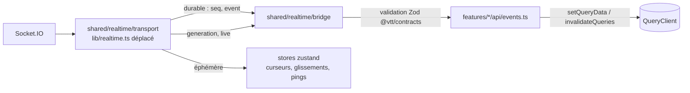

# Architecture du front (`frontend/`)

État au 27/09/2026, branche `chore/phase-0-monorepo`. Statut : **proposition à valider** (§ 7).
Ce document est le contrat que suivent les agents qui refont le front domaine par domaine.

Périmètre : le shell de l'app et la navigation, l'authentification et le compte, le profil, les amis,
les campagnes (liste, création, invitations, membres, page de campagne), les personnages (liste,
création, fiche pilotée par le système), les dés (lanceur, historique, boutique, orchestrateur 3D
conservé), les panneaux de la page de jeu autour de la carte (notes, historique, chat, musique et
son, combat et initiative, tableau de bord MJ), les paramètres et les thèmes.

**Hors périmètre : la carte** (canevas, rendu, outils, PNJ sur la carte, ombres, visibilité,
brouillard). Elle aura son propre passage. Ce document ne fixe que ses conventions d'intégration
(§ 4.1).

Règle d'or, héritée de [refacto.md](refacto.md) : **on garde toutes les fonctionnalités et tous les
comportements vus par l'utilisateur, et on refait l'architecture**. Exemple : pour les dés 3D, la
physique fait foi. La face est lue à l'arrêt, puis le serveur calcule ([dice-3d.md](dice-3d.md),
[api-dice.md](api-dice.md)).

## 1. Résumé

- **Structure par fonctionnalités** : `src/features/<domaine>/{api,model,ui,lib}` avec une API
  publique (`index.ts`), plus `src/shared/` pour le transverse. `app/` ne fait que router et
  composer. Les frontières sont vérifiées en CI par dependency-cruiser et ESLint.
- **Données serveur** dans TanStack Query uniquement : des clés par domaine, toutes les données
  d'une campagne sous `['campaign', id]`, des mutations versionnées (409), optimistes avec
  rollback, et idempotentes pour les créations.
- **Client HTTP typé, généré depuis l'OpenAPI** que chaque service expose déjà (openapi-typescript
  et openapi-fetch). Les **événements** du bus sont typés par les schémas Zod de `@vtt/contracts`.
  Les erreurs `problem+json` sont normalisées en `ApiProblem`.
- **Un seul pont temps réel** : le transport actuel (`lib/realtime.ts`) alimente un pont qui
  applique chaque événement au cache (patch ou invalidation), gère la resynchronisation et
  centralise le polling de secours.
- **État client** dans des stores zustand par fonctionnalité, instanciés par campagne quand ils
  en dépendent, lus avec des sélecteurs. Plus de contexte React pour l'état qui change souvent,
  plus d'événements `window`.
- **Design system** : une seule échelle de tokens sémantiques. Les 5 thèmes de l'app et
  `presentation.yaml` alimentent les mêmes variables. Aucune couleur en dur, primitives Radix
  accessibles, `color-mix()` pour l'opacité.
- **Qualité** : ESLint strict (il n'y en a pas aujourd'hui), TypeScript strict sur le nouveau code,
  vitest, Testing Library et MSW. Playwright est lancé par Théo seul. Observabilité légère : erreurs,
  Web Vitals et `traceparent`.

## 2. Audit critique du front actuel

### 2.1 Mesures

| Mesure                                                  | Valeur                                                                                                                                               |
| ------------------------------------------------------- | ---------------------------------------------------------------------------------------------------------------------------------------------------- |
| Taille de `frontend/src`                                | 345 fichiers, ~87 500 lignes TS/TSX                                                                                                                  |
| Fichiers `'use client'`                                 | 209 ; 20 pages sur 21                                                                                                                                |
| Tests                                                   | **0** (`"test": "echo 'pas encore de tests'"`)                                                                                                       |
| Lint                                                    | **aucun ESLint** : `"lint": "prettier --check src"`. On trouve pourtant 17 `eslint-disable` et 148 `console.*`                                       |
| `any`                                                   | 116, dont 63 hors carte                                                                                                                              |
| `noUncheckedIndexedAccess` activé                       | 668 erreurs, en grande majorité dans la carte                                                                                                        |
| Contextes React                                         | 7 (`contexts/`), empilés dans `map-layout.tsx:52-76`                                                                                                 |
| Stores maison (`useSyncExternalStore` au niveau module) | ~13 singletons (carte, toasts ×2, préférences de dés…)                                                                                               |
| Événements `window` personnalisés                       | 11 points d'émission, une dizaine de noms (`vtt-trigger-3d-roll`, `audioMixerVolumeChange`…)                                                         |
| Domaines branchés sur le temps réel                     | 3 : historique, historique des dés, carte                                                                                                            |
| Polling                                                 | chat toutes les 5 s (liste entière), historique et jets toutes les 30 s en secours                                                                   |
| Couleurs                                                | 1 478 hex littéraux dans 91 fichiers (728 sont des données de skins, légitimes), 479 classes `bg-[#…]`, 1 275 classes de palette brute (`zinc-800`…) |
| Systèmes de tokens concurrents                          | 3 : shadcn HSL (432 usages), legacy `--bg-dark`/`--accent-brown` (763 classes `[var(--…)]`), `--fiche-*`                                             |
| Plus gros fichiers **dans le périmètre**                | `dice-roller.tsx` 2 544, `(historique)/format.ts` 730, `store-modal.tsx` 710, `Historique.tsx` 684, `profile/page.tsx` 558                           |

Pour mémoire, les quatre plus gros fichiers relèvent de la carte : `map-view.tsx` (4 974 lignes),
`hooks/map/useCanvasMouseDown.ts` (1 809), `(overlays)/ContextMenuPanel.tsx` (1 590) et
`lib/visibility.ts` (1 462). Leur passage dédié les traitera. Un seul constat est retenu ici : du
code propre à la carte est rangé comme utilitaire générique (`lib/visibility.ts`,
`lib/obstacle-utils.ts`, `contexts/*`). Rien ne délimite un domaine.

### 2.2 Les 15 problèmes les plus graves

Classés par gravité : d'abord les bugs visibles, puis la dette qui les produit.

| #   | Problème (preuve)                                                                                                                                                                                                                                                                                                                                                                                                                                                                                                 | Impact                                                                                                                                                                                          | Parade (§)                                            |
| --- | ----------------------------------------------------------------------------------------------------------------------------------------------------------------------------------------------------------------------------------------------------------------------------------------------------------------------------------------------------------------------------------------------------------------------------------------------------------------------------------------------------------------- | ----------------------------------------------------------------------------------------------------------------------------------------------------------------------------------------------- | ----------------------------------------------------- |
| 1   | **Temps réel absent de la plupart des écrans.** La fiche (`lib/characters.ts:181`), le détail de la campagne, les membres, les personnages engagés, le chat et le combat n'écoutent aucun événement. Le chat relit **toute** la liste toutes les 5 s (`campaign-chat.tsx:16,49-53`), alors que `campaign.message_posted` existe.                                                                                                                                                                                  | **Bug de parité** : le MJ baisse les PV, le joueur ne le voit qu'après un rechargement (le legacy le voyait par `onSnapshot`). Le polling coûte des requêtes pour rien.                         | Pont temps réel (§ 3.6)                               |
| 2   | **Pas de cache de données serveur.** `useResource` (`lib/resource.ts:19`) refait l'appel à chaque montage, sans dédoublonnage ni invalidation. `getCampaign(id)` est lu à 5 endroits (`campaigns/[id]/page.tsx:43`, `[id]/characters/page.tsx:54`, `play/page.tsx:40`, `characters/[id]/page.tsx:28`, `use-history.ts:106`). `update()` ne corrige que la copie locale.                                                                                                                                           | Requêtes redondantes. Des copies divergent : après un renommage, les autres composants gardent l'ancien nom. Après chaque mutation, il faut penser au `reload()`.                               | TanStack Query (§ 3.4)                                |
| 3   | **Écritures perdues.** Après un 409, `lib/characters.ts:210-221` relit puis **rejoue à l'aveugle** : un `PUT /valeurs {PV: 17}` écrase la modification concurrente du MJ. `lib/saveSettings.ts:37-40` lit le profil puis envoie l'objet `settings` complet : deux réglages rapprochés s'écrasent, chaque réglage coûte un GET, et la session garde l'ancien profil. `PATCH /v1/campaigns/:id` n'a pas de `version`.                                                                                               | Perte de données silencieuse, sans message.                                                                                                                                                     | Politiques de conflit (§ 3.4), prérequis back (§ 6.4) |
| 4   | **Bus d'événements `window` non typé.** On le trouve dans `dice-roller.tsx:421,536`, `(dices)/throw.tsx:422,506,566`, `throw-host.tsx:29-37` (file de rejeu artisanale), `lib/dice.ts:295-309`, `SettingsContext.tsx:20`, `AudioMixerPanel.tsx:49,60`, `dice-roller/sound.ts:38`, et `vtt-open-character-sheet` est écouté par la carte.                                                                                                                                                                          | Contrats implicites (`detail` casté), écouteurs qui fuient, collisions entre instances, ordre d'arrivée fragile. Impossible à tester.                                                           | Commandes typées et stores (§ 3.7, § 4.3)             |
| 5   | **Aucun garde-fou qualité.** Il n'y a ni ESLint (donc pas de `react-hooks/exhaustive-deps` : les dépendances d'effets ne sont jamais vérifiées) ni aucun test. `frontend/package.json` : le lint n'est que Prettier, le test ne fait qu'un `echo`.                                                                                                                                                                                                                                                                | Les régressions passent en silence, surtout dans les effets et les fermetures périmées, fréquents dans le code copié.                                                                           | § 3.12, § 3.13                                        |
| 6   | **Composants-dieux.** `dice-roller.tsx` fait 2 544 lignes : 16 `useState`, 7 `useEffect`, 9 `useRef`, et ~1 700 lignes de JSX qui mêlent l'analyse de la notation, l'orchestration 3D, les raccourcis, l'historique, les statistiques, la boutique et les préférences. `store-modal.tsx` (710 lignes : 11 `useState`, 8 `useEffect`). `profile/page.tsx` (558 lignes, 12 `useState`).                                                                                                                             | Tout le panneau se re-rend à chaque frappe. Chaque correction risque une régression, et aucun test n'est possible sans monter l'écran entier.                                                   | Découpe `model`/`ui` (§ 3.1, § 4.3)                   |
| 7   | **Contrats recopiés à la main.** `lib/campaigns.ts:11-128` recopie les schémas de `backend/campaign/src/modules/schemas.ts`. `lib/realtime.ts:37-60` recopie l'enveloppe `EventEnvelope` de `packages/contracts/src/events.ts`. Les charges utiles sont typées `Record<string, unknown>`, donc castées partout.                                                                                                                                                                                                   | Une dérive entre le front et les services ne se voit qu'à l'exécution.                                                                                                                          | Client généré (§ 3.5)                                 |
| 8   | **Codes d'erreur incohérents entre services.** Un conflit de version renvoie `version_perimee` côté character (`depot.ts:285`) et `version_conflict` côté campaign (`maps/common.ts:51`). `ApiError` (`lib/api.ts:17`) ignore `errors[]`, `requestId` et `traceId`, pourtant présents dans le `Problem` de `@vtt/contracts`.                                                                                                                                                                                      | Chaque écran doit connaître des codes différents. Un bug signalé ne peut pas être relié aux logs.                                                                                               | `ApiProblem` (§ 3.5), prérequis back                  |
| 9   | **Pas de frontière d'erreur par zone.** Il n'y a qu'un `app/error.tsx`, qui fait un `console.error`. Une exception dans l'historique ou le panneau de dés fait tomber toute la table de jeu. Chaque écran réinvente ses états (`Loading`, `Notice`, `Message`, `PageError`). Certaines erreurs sont avalées (`campaign-chat.tsx:44`, `catch {}`).                                                                                                                                                                 | Un bug local devient une panne de la partie. L'utilisateur ne sait pas quoi faire, et personne n'est averti.                                                                                    | § 3.11                                                |
| 10  | **Contextes globaux pour de l'état qui change souvent.** 7 providers sont empilés (`map-layout.tsx:52-76`). `SettingsContext.tsx` (269 lignes) met ~20 valeurs dans un seul objet : chaque réglage re-rend tous les consommateurs, la carte comprise. `GameContext.tsx:57-59` expose de faux champs (`isAuthenticated: true`, `isHydrated: true`) pour satisfaire le code copié.                                                                                                                                  | Coût de rendu, dépendances cachées, API mensongères.                                                                                                                                            | zustand et sélecteurs (§ 3.7)                         |
| 11  | **Stores maison.** Environ 13 singletons de module avec `useSyncExternalStore`, sans sélecteurs et au boilerplate recopié. Aucun n'est remis à zéro quand on change de campagne.                                                                                                                                                                                                                                                                                                                                  | Fuite d'état d'une campagne à l'autre dans le même onglet. Pas d'outil de débogage.                                                                                                             | Stores zustand propres à une campagne (§ 3.7)         |
| 12  | **Trois systèmes de tokens et des couleurs en dur.** Les tokens shadcn en HSL (`tailwind.config.ts:23-60`), les variables legacy par classes arbitraires, et `--fiche-*` (`sheet/theme.ts:11-21`, avec sa propre table de hex) coexistent, plus 479 classes `bg-[#…]` et 1 275 classes de palette brute.                                                                                                                                                                                                          | Les thèmes `tavern`, `dungeon`, `royal` et `druid` ne s'appliquent qu'en partie. Le thème du système n'habille que la fiche, alors que le legacy habillait toute la salle (`GameSystemStyles`). | Tokens sémantiques (§ 3.9)                            |
| 13  | **Primitives et bibliothèques en double.** Deux `select` (`ui/select.tsx`, `dice-roller/select.tsx`, faits maison et fermés par un `mousedown` sur le document), deux toasts, deux tooltips. `framer-motion` (26 fichiers) et `motion` (2 fichiers), c'est-à-dire la même bibliothèque embarquée deux fois. `lib/rules-engine/` (~1 000 lignes, le moteur legacy) à côté de `@vtt/rules`. `modules/game-system/types.ts` (485 lignes de types legacy).                                                            | Poids du bundle, accessibilité inégale, deux vérités pour les formules.                                                                                                                         | `shared/ui` Radix (§ 3.9), retraits (§ 5)             |
| 14  | **Découpage du bundle.** `play/page.tsx:30` importe `MapView` statiquement : la carte, ses hooks et ses renderers partent dans le chunk de la page de jeu, même pour afficher un chargement. `throw-fun` est monté à 3 endroits (`dice-widget.tsx:15`, `store-modal.tsx:45`, `throw-3d.tsx:17`), plus `throw-host` : autant de contextes WebGL.                                                                                                                                                                   | Premier affichage de la table ralenti. Risque TDR sous Windows (proposition P13 de [dice-3d.md](dice-3d.md)).                                                                                   | § 3.10                                                |
| 15  | **Flux inversés et props drilling.** `IncarnatedSheet` remonte le personnage au parent par un effet (`play/page.tsx:188`, `onRolling`) pour qu'il le passe au `DiceRoller`, qui reçoit 9 props (8 pour `ActionsPanel`). Le polling de secours et la gestion de `generation` sont codés deux fois, différemment (`use-history.ts:408`, `use-roll-history.ts:195-212`). `same()`/`sameId()` (`play/page.tsx:33`, `campaigns/[id]/page.tsx:36`, `lib/dice.ts:325`) comparent des UUID sans tenir compte de la casse. | Double rendu, couplage entre composants frères, logique recopiée par domaine, comparaisons défensives qui masquent un défaut de normalisation.                                                  | Session de jeu et commandes (§ 3.7), pont (§ 3.6)     |

### 2.3 Ce qui est sain et qu'on garde

- **`lib/api.ts`** : le jeton d'accès reste en mémoire, un seul renouvellement tourne à la fois,
  y compris entre onglets (Web Locks `vtt-refresh`), et l'en-tête CSRF est envoyé. On le garde tel
  quel comme middleware d'authentification du nouveau client.
- **`lib/realtime.ts`** : une connexion par onglet, reprise par `seq`, `generation`, désabonnement
  différé (StrictMode). On le déplace sans le modifier : il devient le transport de § 3.5.
- **La fiche** : un aperçu local calculé par `@vtt/rules` pendant l'écriture, des écritures
  sérialisées, et un registre de widgets piloté par `presentation.fiches`, sans aucune clé de jeu
  en dur.
- **Les dés** : un `Idempotency-Key` sur `createRoll` (`lib/dice.ts:227`), le moteur 3D, ses
  délais (chargement 30 s, arrêt 10 s) et son repli vers un tirage serveur.

## 3. Architecture cible

### 3.1 Principes

1. `app/` route et compose. Aucun `fetch`, aucun état métier, aucune logique.
2. Une fonctionnalité est un dossier doté d'une API publique (`index.ts`). On n'importe jamais ses
   fichiers internes depuis l'extérieur.
3. Chaque sorte d'état a un seul endroit. Les données serveur vont dans TanStack Query, l'état
   client partagé dans zustand, l'état local d'un composant dans `useState`. Un contexte React ne
   sert qu'à injecter une valeur stable.
4. Aucun composant ne touche `fetch` ni le socket : il passe par les hooks d'`api/`.
5. Aucun événement `window` entre fonctionnalités : on passe par une API publique ou une commande
   typée.
6. Aucune couleur en dur : uniquement des tokens.
7. Toute logique vit dans `model/` ou `lib/` (du TypeScript pur, testé). `ui/` affiche et délègue.
8. Chaque lot de migration liste les comportements du legacy qu'il conserve. Il ne supprime ni ne
   modifie aucun comportement validé.

### 3.2 Arborescence

```
frontend/src/
  app/                          routes, layouts, error.tsx/loading.tsx par segment ; composition seule
    providers.tsx               QueryClient, thème, session, pont temps réel personnel
  features/
    session/                    état d'authentification, gardes de routes, profil courant
    account/                    profil, sécurité, clés d'API, titres
    friends/  players/          amis, profils publics
    systems/                    chargement des systèmes et présentations (@vtt/rules)
    campaigns/                  liste, création, rejoindre, invitations, membres, bannis, sessions, réglages
    characters/                 liste, résumés, création d'un personnage (appel API)
    character-sheet/            fiche pilotée par la présentation (widgets)
    character-creation/         assistant de création (étapes du système)
    dice/                       lanceur, historique, statistiques, boutique, préférences
      three/                    moteur 3D repris tel quel (throw, visual-die, matériaux, audio)
    chat/  notes/  history/     panneaux
    combat/                     initiative, tours, tableau de bord MJ, PNJ
    audio/                      moteur audio, mixeur, panneaux musique et son (docs/audio.md)
    settings/                   préférences du compte et de l'appareil, choix du thème
    game-session/               contexte de la partie : campagne, rôle, personnage incarné, vue simulée, commandes
    game-table/                 page de jeu : registre des panneaux, disposition, montage de la carte
    landing/                    accueil public, blocs marketing
    map/                        HORS PÉRIMÈTRE, voir § 4.1
  shared/
    api/                        client openapi-fetch, ApiProblem, messages d'erreur, QueryClient
    realtime/                   transport (lib/realtime.ts déplacé) et pont vers le cache
    ui/                         primitives (Button, Dialog, Select Radix…), AsyncBoundary, états
    theme/                      tokens, thèmes de l'app, portée du thème du système
    shortcuts/                  registre des raccourcis (défauts, surcharges, portées)
    observability/              erreurs, Web Vitals, traceparent
    lib/                        utilitaires purs (dates, formats, ids)
  test/                         setup vitest, handlers MSW, faux transport temps réel, rendu avec providers
```

Intérieur d'une fonctionnalité :

| Dossier    | Contenu                                                                                                                                   |
| ---------- | ----------------------------------------------------------------------------------------------------------------------------------------- |
| `api/`     | `keys.ts` (fabrique de clés), `queries.ts` (`queryOptions`), `mutations.ts` (hooks `useVerbNoun`), `events.ts` (gestionnaires temps réel) |
| `model/`   | store zustand, sélecteurs, logique métier pure (analyse de notation, orchestration d'un jet…)                                             |
| `ui/`      | composants ; un fichier par composant exporté, en kebab-case                                                                              |
| `lib/`     | fonctions pures sans état propres à la fonctionnalité (formatage, conversions)                                                            |
| `index.ts` | API publique : composants de haut niveau, hooks, types. Tout le reste est privé                                                           |

### 3.3 Frontières et règles d'import

| Depuis               | Peut importer                                                                                           | Interdit                                                           |
| -------------------- | ------------------------------------------------------------------------------------------------------- | ------------------------------------------------------------------ |
| `app/**`             | `@/features/<x>` (index), `@/shared/**`                                                                 | fichiers internes d'une fonctionnalité, zones legacy               |
| `features/<x>/**`    | ses propres fichiers, `@/shared/**`, `@vtt/*`, `@/features/<y>` (index) si `y` est un niveau en dessous | `app/`, fichiers internes d'une autre fonctionnalité, zones legacy |
| `shared/**`          | `@/shared/**`, `@vtt/contracts`, `@vtt/rules`, `@vtt/api-types`                                         | `features/`, `app/`, zones legacy                                  |
| Zones legacy (§ 6.1) | tout, temporairement (adaptateurs)                                                                      | —                                                                  |

Niveaux (un graphe sans cycle ; une fonctionnalité n'importe que des niveaux inférieurs) :

| Niveau | Fonctionnalités                                                                                       |
| ------ | ----------------------------------------------------------------------------------------------------- |
| 1      | `session`, `systems`                                                                                  |
| 2      | `account`, `friends`, `players`, `campaigns`, `characters`, `settings`, `audio`                       |
| 3      | `character-sheet`, `character-creation`, `dice`, `chat`, `notes`, `history`, `combat`, `game-session` |
| 4      | `map` (zone legacy), `landing`                                                                        |
| 5      | `game-table`                                                                                          |

Contrôle automatique :

- **dependency-cruiser** en CI (`pnpm --filter @vtt/web lint`) : règles `no-circular`,
  `feature-public-api-only` (`^src/features/([^/]+)/.+` n'est importable que par sa propre
  fonctionnalité), `shared-not-to-features`, `feature-levels` (liste des arêtes permises
  ci-dessus) et `no-new-to-legacy` (avec une liste blanche datée, § 6.1) ;
- **ESLint `no-restricted-imports`** pour un retour immédiat dans l'éditeur :
  `patterns: [{ group: ['@/features/*/*'], message: "Passer par l'index de la fonctionnalité" }]`,
  et, dans `shared/**`, interdiction de `@/features/*` et `@/app/*`.

### 3.4 Données serveur : TanStack Query

**Clés.** Chaque fonctionnalité fournit une fabrique dans `api/keys.ts`. Tout ce qui appartient à
une campagne, quel que soit le service qui le sert, vit sous `['campaign', id]`. Une
resynchronisation se fait alors en un seul `invalidateQueries`.

| Domaine      | Racine                                | Exemples                                                                                                                                                                                        |
| ------------ | ------------------------------------- | ----------------------------------------------------------------------------------------------------------------------------------------------------------------------------------------------- |
| Moi          | `['me']`                              | `['me','profile']`, `['me','settings']`, `['me','dice-preferences']`, `['me','friends']`, `['me','rolls']` (jets personnels), `['me','api-keys']`                                               |
| Campagnes    | `['campaigns']`                       | `['campaigns','list',{role}]`, `['campaigns','public',{search,page}]`                                                                                                                           |
| Une campagne | `['campaign', id]`                    | `[…,'characters']`, `[…,'bans']`, `[…,'sessions']`, `[…,'messages']`, `[…,'notes']`, `[…,'combat']`, `[…,'history',filtres]`, `[…,'dice','rolls']`, `[…,'dice','stats',filtres]`, `[…,'map',…]` |
| Personnages  | `['characters']`, `['character', id]` | `['characters','list']`, `['character',id]`, `['character',id,'purchases',version]`, `['character',id,'creation',version]`                                                                      |
| Systèmes     | `['systems']`                         | `['systems','list']`, `['systems',id]` (`staleTime: Infinity`, document versionné)                                                                                                              |
| Profils      | `['users', id]`                       | profils publics                                                                                                                                                                                 |

```ts
// features/campaigns/api/keys.ts
export const campaignKeys = {
  lists: () => ['campaigns', 'list'] as const,
  list: (f: { role?: CampaignRole }) => [...campaignKeys.lists(), f] as const,
  scope: (id: string) => ['campaign', id] as const,
  detail: (id: string) => [...campaignKeys.scope(id), 'detail'] as const,
  characters: (id: string) => [...campaignKeys.scope(id), 'characters'] as const,
};
```

**Valeurs par défaut** (`shared/api/query-client.ts`) :

- `staleTime` de 30 s et `gcTime` de 5 min ;
- `retry` : 2 fois pour le réseau et les 5xx, jamais pour les 4xx ;
- le 401 est traité par le client HTTP (renouvellement), jamais par Query ;
- les données d'une campagne suivie en direct passent en `staleTime: Infinity` : c'est le pont qui
  les tient à jour (§ 3.6).

**Mutations** (`api/mutations.ts`) :

- la réponse du serveur fait foi : `setQueryData` du détail, puis invalidation des listes
  concernées ;
- **optimistes avec rollback** (`onMutate` : `cancelQueries`, instantané, `setQueryData` ;
  `onError` : restauration ; `onSettled` : invalidation) pour les actions fréquentes et peu
  risquées : ressources et jauges, bascules, envoi d'un message (affiché en attente), préférences
  de dés, réglages ;
- **la fiche** garde son mécanisme actuel sous une forme standard : les aperçus en attente se
  lisent avec `useMutationState({ filters: { mutationKey: ['character', id, 'write'], status:
'pending' } })` et sont recalculés par `@vtt/rules` ;
- **sérialisation par agrégat** avec `scope: { id: 'character:<id>' }` (TanStack Query v5) : cela
  remplace la file manuelle de `useCharacter` ;
- **versions** : la version est lue dans le cache au moment de l'exécution, pas du rendu. Sur un
  409 `version_conflict`, chaque mutation déclare sa politique :

| Politique | Quand                                                                | Comportement                                                                                                                                                                             |
| --------- | -------------------------------------------------------------------- | ---------------------------------------------------------------------------------------------------------------------------------------------------------------------------------------- |
| `replay`  | opérations commutatives (achat, ajout d'un exemplaire, repos, bonus) | relire, puis rejouer une fois (le comportement actuel)                                                                                                                                   |
| `rebase`  | affectations absolues (`PUT /valeurs`, renommage)                    | relire ; si les champs visés n'ont pas changé entre la version de base et la version fraîche, rejouer ; sinon garder la valeur du serveur et avertir (« modifié par le MJ entre-temps ») |
| `surface` | formulaires longs (réglages de campagne)                             | garder la saisie, afficher la version du serveur, laisser l'utilisateur choisir                                                                                                          |

- **idempotence** : toute création (jet, message, invitation) envoie un `Idempotency-Key` généré
  une fois par intention de l'utilisateur, et conservé entre les nouvelles tentatives.

**Pagination** :

| Forme                           | Données               | Outil                                                                                                                        |
| ------------------------------- | --------------------- | ---------------------------------------------------------------------------------------------------------------------------- |
| Curseur `before=<id>`           | jets de dés, messages | `useInfiniteQuery` ; le temps réel insère en tête de la page 0 (`prependToInfinite`, `removeFromInfinite` dans `shared/api`) |
| Séquence `beforeSeq`/`afterSeq` | historique            | `useInfiniteQuery`                                                                                                           |
| Page et total                   | campagnes publiques   | `useQuery` + `placeholderData: keepPreviousData`                                                                             |

### 3.5 Client API typé

**Recommandation : générer les types depuis l'OpenAPI des services** (openapi-typescript), avec
openapi-fetch à l'exécution. Pour les **événements** du bus, les schémas Zod de `@vtt/contracts`.

Vérifié dans le code :

- chaque service expose `/openapi.json`, généré par `@vtt/platform` depuis ses schémas Zod
  (`backend/platform/src/server.ts:122-126`) ;
- la gateway **n'agrège pas** l'OpenAPI, contrairement à ce qu'annonce [refacto.md](refacto.md) :
  `backend/gateway/src/app.ts` ne fait que relayer ;
- toutes les routes n'ont pas encore de schéma de réponse (mesure grossière par grep : identity
  ~21/37, campaign ~28/66, character 23/24, dice 11/12, history 3/3, billing 7/7).

Pourquoi l'OpenAPI plutôt que des schémas Zod déplacés dans `packages/contracts` :

1. La source de vérité existe déjà : ce sont les schémas que les services valident et
   sérialisent, `.transform` compris. Les déplacer demanderait de refaire ~150 routes dans des
   services où d'autres agents travaillent, et de sortir des énumérations qui viennent du schéma
   de base de données (`campaign/src/modules/schemas.ts:4`).
2. Le coût à l'exécution est nul (des types seulement), et le serveur garantit déjà la forme des
   réponses. Pour les événements, la validation à l'exécution est utile : ils viennent de
   plusieurs producteurs. Zod y est déjà présent dans le bundle, par `@vtt/rules`.
3. La spec fusionnée sert aussi aux clients tiers (clés d'API) et à la documentation.

Chaîne de génération :

- `tools/openapi` construit chaque service à partir de sa fabrique de test
  (`backend/*/src/test/test-app.ts` ou `app-de-test.ts`), sans réseau, puis appelle
  `app.swagger()` (à vérifier : ces fabriques démarrent-elles sans base ?) ;
- il fusionne les `paths` (déjà préfixés par `/v1`) et échoue en cas de collision ;
- il écrit `packages/api-types/openapi.json`, puis `openapi-typescript` produit `src/schema.d.ts` ;
- en CI, on régénère et on vérifie `git diff --exit-code`.

```ts
// shared/api/client.ts
export const http = createClient<paths>({ baseUrl: '' });
http.use(authMiddleware); // code actuel de lib/api.ts : jeton en mémoire, refresh unique (Web Locks), CSRF
http.use(traceMiddleware); // traceparent W3C par requête (§ 3.14)
http.use(problemMiddleware); // problem+json → throw ApiProblem
```

`ApiProblem` porte `status`, `code`, `title`, `detail`, `errors[]` (chemin et message, repris sur
les champs du formulaire), `requestId` et `traceId`, avec un garde `isProblem(e, 'version_conflict')`.
Les messages en français sont indexés par `code` dans `shared/api/problem-messages.ts`, et une
fonctionnalité peut les surcharger (`joinErrorMessage` y déménage). Un 5xx affiche un message
générique et « Référence : `<requestId>` ». Les services renvoient des UUID en minuscules (`Uuid()`
fait un `toLowerCase`) : les comparaisons `same()`/`sameId()` disparaissent.

### 3.6 Temps réel : transport et pont



- **Transport** : `lib/realtime.ts` déplacé tel quel dans `shared/realtime/transport.ts`. Un
  fichier de réexport reste à l'ancien chemin pour la carte. Les hooks `useCampaignEvents`,
  `useCampaignPresence` et `useCampaignEphemeral` restent disponibles pour la zone carte et pour
  l'éphémère.
- **Pont** : un `<RealtimeBridge campaignId>` monté par `game-session` et la page de campagne,
  plus un pour les événements personnels (`null`), monté dans `app/providers.tsx` une fois
  connecté. C'est le **seul** abonné du canal durable pour le cache.
- **Gestionnaires** : une table par fonctionnalité, faite de fonctions pures, donc testables avec
  un simple `QueryClient` :

```ts
// features/campaigns/api/events.ts
export const campaignEventHandlers: EventHandlers = {
  'campaign.updated': (e, { qc }) => patchOrInvalidate(qc, campaignKeys.detail(e.roomId!), e),
  'campaign.member_joined': (e, { qc }) =>
    qc.invalidateQueries({ queryKey: campaignKeys.scope(e.roomId!) }),
  'campaign.character_played': (e, { qc }) =>
    qc.invalidateQueries({ queryKey: campaignKeys.characters(e.roomId!) }),
};
```

Règles appliquées par le pont :

1. **Validation** : `EventEnvelope.safeParse`, puis le schéma de la charge utile s'il est déclaré
   dans `@vtt/contracts`. Si c'est invalide, on invalide les clés de l'agrégat et on le signale à
   l'observabilité.
2. **Écho** : l'écrivain a déjà appliqué la réponse du serveur. Un événement dont la `version` est
   inférieure ou égale à celle du cache est ignoré.
3. **Expurgé** (`redacted: true`) : on invalide la clé précise, et c'est la relecture REST qui
   applique le masquage.
4. **`generation` change** (premier abonnement, `resync`, reconnexion) : on invalide
   `['campaign', id]`, ou `['me']` pour les événements personnels.
5. **`live` passe à faux** : `setQueryDefaults(['campaign', id], { refetchInterval: 30_000 })`.
   Quand le direct revient, on retire ce réglage et on invalide. **Cela remplace tous les pollings
   de secours par hook.**
6. **Rafales** (rejeu après une reconnexion) : les mises à jour sont regroupées dans
   `notifyManager.batch`.
7. **`unsubscribed`** (membre retiré, campagne supprimée) : la fonctionnalité `campaigns` est
   prévenue et reprend le comportement du legacy.

Correspondance initiale, d'après les `api-*.md` :

| Événements                                   | Effet sur le cache                                                                                                |
| -------------------------------------------- | ----------------------------------------------------------------------------------------------------------------- |
| `campaign.updated`                           | patch du détail d'après `changes`, sinon invalidation ; invalidation des listes                                   |
| `campaign.member_*`, `campaign.character_*`  | invalidation du détail et de `characters`                                                                         |
| `campaign.message_posted` / `_deleted`       | insertion ou retrait dans la page 0 des messages                                                                  |
| `campaign.session_*`                         | invalidation de `sessions`                                                                                        |
| `combat.*`                                   | invalidation de `combat`, ou patch si la charge utile porte l'état complet                                        |
| `character.updated` / `_deleted`             | invalidation de `['character', id]` si la version dépasse celle du cache (la fiche est recalculée par le serveur) |
| `dice.rolled`                                | relecture `GET /rolls/:id` (masquage), puis insertion en tête                                                     |
| `dice.roll_deleted` / `dice.history_cleared` | retrait / remise à zéro de la liste                                                                               |
| `dice.preferences_updated`                   | `setQueryData(['me','dice-preferences'])` (charge utile complète)                                                 |
| tout événement                               | ajout à la timeline de l'historique si elle est chargée et que les filtres correspondent (logique de `format.ts`) |

### 3.7 État client : zustand

| État                                                                    | Où                                                                             |
| ----------------------------------------------------------------------- | ------------------------------------------------------------------------------ |
| Données serveur (campagnes, fiches, jets, messages, réglages du compte) | TanStack Query                                                                 |
| État local d'un composant (saisie, ouverture d'un menu)                 | `useState`                                                                     |
| État partagé d'une zone (panneau ouvert, sélection, vue joueur simulée) | store zustand **propre à la campagne**, créé par le provider de `game-session` |
| Préférences de l'appareil (raccourcis, largeur des panneaux, volumes)   | store zustand + `persist` (localStorage, en gardant les clés actuelles)        |
| Éphémère temps réel (curseurs, glissements)                             | store zustand de la fonctionnalité concernée                                   |

Règles :

- les stores sont créés avec `createStore` et fournis par un contexte, sur le modèle recommandé
  par zustand pour Next. Un singleton de module n'est permis que pour un état vraiment global à
  l'onglet (mixeur audio, file des lancers 3D) ;
- on lit avec un sélecteur (`useStore(store, (s) => s.openPanel)`), ou avec `useShallow` pour
  plusieurs valeurs. Jamais le store entier ;
- les actions vivent dans le store, et la logique appelée par ces actions dans `model/` ;
- les réglages du compte sont des données serveur : une mutation optimiste, un `scope` pour
  sérialiser les écritures, puis un patch partiel quand identity l'acceptera (§ 6.4).

**Commandes entre fonctionnalités** : elles remplacent les événements `window`. `game-session`
expose une interface typée, implémentée par les fonctionnalités qui possèdent l'action et
consommée par les autres (dont la carte) :

```ts
export interface GameCommands {
  openPanel(id: PanelId): void;
  openCharacterSheet(characterId: string): void; // remplace 'vtt-open-character-sheet'
  rollDice(input: RollInput): Promise<Roll>; // passe par l'orchestrateur des dés (§ 4.3)
}
```

`vtt-dice-rolls-changed` devient une invalidation de requête, et `audioMixerVolumeChange` un store
(§ 4.2).

### 3.8 Page de jeu : registre des panneaux

`game-table` reprend les panneaux du legacy (`legacy/src/app/[roomid]/map/layout.tsx`) : fiche,
compétences, dés, notes, notes rapides, chat, tableau de bord MJ, PNJ, historique, explorateur de
cartes, musique, générateur de rencontres, et panneaux des modules. Chacun est déclaré et chargé
à la demande :

```ts
definePanel({
  id: 'history',
  title: 'Historique',
  icon: History,
  roles: ['gm'],
  shortcut: 'TAB_HISTORIQUE',
  mount: 'persistent', // monté à la première ouverture, puis gardé masqué (comme le legacy)
  width: 'w-full sm:w-[500px] md:w-[600px] lg:w-[400px]',
  load: () => import('@/features/history/ui/history-panel'),
});
```

Chaque panneau est enveloppé dans un `AsyncBoundary` (§ 3.11). Le panneau ouvert est rangé dans le
store de la session. Les raccourcis passent par `shared/shortcuts` : un seul écouteur `keydown`,
des portées (global, table, carte, dés), des surcharges persistées sous les clés actuelles
`vtt-dd-shortcuts-v2` et `vtt-dd-custom-shortcuts`. L'API d'extension des bundles
([front-star-wars.md](front-star-wars.md), R) est hors lot.

### 3.9 Design system

**Tokens à trois niveaux** (`shared/theme/tokens.css`) :

- des primitives par thème ;
- des sémantiques : `--color-surface`, `--color-surface-raised`, `--color-surface-sunken`,
  `--color-canvas`, `--color-border`, `--color-text`, `--color-text-muted`, `--color-accent`,
  `--color-accent-hover`, `--color-danger`, `--color-success`, `--color-warning`, `--color-focus`,
  plus les rayons, les ombres et la typographie (`--font-body`, `--font-title`) ;
- des tokens de composant, seulement quand c'est nécessaire.

| Source actuelle                                                                                                                            | Devient                                                          |
| ------------------------------------------------------------------------------------------------------------------------------------------ | ---------------------------------------------------------------- |
| `--bg-dark`, `--bg-card`, `--bg-darker`                                                                                                    | `surface`, `surface-raised`, `surface-sunken`                    |
| `--border-color`, `--text-primary`, `--text-secondary`                                                                                     | `border`, `text`, `text-muted`                                   |
| `--accent-brown`, `--accent-brown-hover`                                                                                                   | `accent`, `accent-hover`                                         |
| shadcn `--background`, `--card`, `--primary`…                                                                                              | les mêmes sémantiques                                            |
| `presentation.theme.couleurs` : `fond`, `carte`, `fondProfond`, `canevas`, `bordure`, `texte`, `texteSecondaire`, `accent`, `accentSurvol` | les mêmes sémantiques, posées sur une portée `data-system-theme` |

- **Deux portées qui se composent** :
  - les 5 thèmes de l'app (`dark`, `tavern`, `dungeon`, `royal`, `druid`), portés par next-themes
    (`attribute="data-theme"`) ;
  - le thème du système de jeu, posé sur la page de jeu (comme le legacy `GameSystemStyles`), sur
    la fiche et sur les dialogues qu'elle ouvre (portails compris).

  Tout composant qui lit les tokens sémantiques se thématise seul, et `--fiche-*` disparaît. Les
  anciennes variables restent des **alias** jusqu'à la suppression des zones legacy : la carte
  s'affiche à l'identique.

- **Tailwind v3** : on ne génère jamais `var(--x)/N`, qui ne produit aucun CSS. Les couleurs sont
  déclarées avec `color-mix` et `<alpha-value>`, par exemple
  `surface: 'color-mix(in srgb, var(--color-surface) calc(<alpha-value> * 100%), transparent)'`,
  pour que `bg-surface/80` fonctionne. **À prouver dans le lot 0c** en compilant une fixture avec le
  CLI Tailwind et en cherchant la règle dans le CSS produit.
- **Interdits (ESLint `no-restricted-syntax` sur les chaînes de `className`)** dans
  `features/**` et `shared/**` : `#[0-9a-f]{3,8}`, les palettes brutes
  (`(bg|text|border|ring|from|via|to|fill|stroke)-(zinc|gray|slate|…)-\d+`) et `\[var\(--[^\]]+\)\]/\d+`.
  Exceptions déclarées : les données de skins de dés (`dice/three/dice-definitions.ts`) et les
  renderers canevas.
- **Primitives** (`shared/ui`, issues de `components/ui` nettoyé) : Button, IconButton, Input,
  Textarea, Label, Select, Dialog, Sheet, DropdownMenu, Tooltip, Popover, Tabs, Switch, Slider,
  Avatar, Badge, Card, ScrollArea, Toast (un seul), ConfirmDialog, Skeleton, EmptyState,
  ErrorState, AsyncBoundary. Select, Tooltip, Popover et Tabs passent sur **Radix**. Les
  composants décoratifs (glare-card, image-auto-slider, testimonial…) rejoignent `landing/ui`.
- **Accessibilité** : cible WCAG 2.2 AA.
  - un focus visible (`--color-focus`), la navigation au clavier fournie par Radix, des libellés
    sur les champs et les boutons-icônes ;
  - `aria-live` sur le résultat des dés et sur les toasts ;
  - `prefers-reduced-motion`, pour motion et pour la 3D (P10 de dice-3d.md) ;
  - un test vitest qui calcule le contraste `texte`/`fond` de chaque thème et de chaque
    `presentation.yaml`, et signale un ratio inférieur à 4,5.

### 3.10 Performance

- **Chargement à la demande** :
  - three, cannon et drei ne sont jamais dans le premier chargement, ce qui est déjà acquis pour
    l'accueil (327 Ko gz, dice-3d.md § 1) ;
  - la carte est montée par `next/dynamic` (`ssr: false`) depuis `game-table` ;
  - les panneaux lourds (statistiques, boutique, historique) sont chargés par `load()`.
- **Budgets** : le JS gzippé du premier chargement de chaque route est mesuré au lot 0 selon la
  méthode de dice-3d.md. Ensuite, on ne le dépasse jamais de plus de 5 % sans décision explicite.
- **Rendu** :
  - des sélecteurs zustand, plus de contexte-objet géant ;
  - les calculs dérivés (fiche, pools de dés) mémoïsés dans `model/` ;
  - `useDeferredValue` pour les recherches.
- **Listes** : `@tanstack/react-virtual` pour l'historique des dés, le chat, la timeline et les
  catalogues (bestiaire, équipement, 100 espèces).
- **WebGL** : un seul canevas partagé (P13 de dice-3d.md), à décider avec le lot des dés et à
  valider sous Windows.

### 3.11 Erreurs, chargement, états vides

- `error.tsx` et `loading.tsx` par segment : `(account)`, `campaigns/[id]`, `play`,
  `characters/[id]`.
- `AsyncBoundary` (dans `shared/ui`) : une frontière d'erreur de ~40 lignes, sans dépendance,
  réinitialisée avec `QueryErrorResetBoundary`, plus un `Suspense` avec squelette. Elle entoure
  chaque panneau de la table : une erreur dans l'historique n'affecte plus le reste.
- Les données indispensables à une zone se lisent avec `useSuspenseQuery`, sous `AsyncBoundary`,
  derrière la garde de session (jamais pendant le rendu serveur). Les données secondaires, avec
  `useQuery`.
- Trois états standard : `Skeleton`, `EmptyState` (avec une action : « Créer une campagne »…) et
  `ErrorState` (message en français, bouton « Réessayer », référence `requestId`).
- Erreurs de mutation : un toast avec le message du `code` ; les `errors[]` s'affichent sur les
  champs. Aucun `catch {}` vide : on signale toujours à l'observabilité.

### 3.12 Tests

- **Outils** : vitest (jsdom), Testing Library avec user-event et jest-dom, et MSW 2. Les handlers
  MSW sont typés par `paths` : une dérive de contrat casse la compilation des tests. Un faux
  transport temps réel en mémoire (`src/test/realtime.ts`) permet de tester le pont et les hooks.
- **Pyramide** :
  - tests unitaires : `model/`, `lib/`, gestionnaires d'événements, politiques de conflit,
    orchestrateur de jet ;
  - tests de composants : `ui/` avec MSW, en couvrant le cas nominal, le 4xx avec `code`, le 409,
    le 5xx et l'état vide ;
  - e2e Playwright dans `frontend/e2e/` : parcours critiques (connexion, créer ou rejoindre une
    campagne, créer un personnage, modifier une jauge, jet avec et sans 3D, chat, tour de combat).
- **Les agents écrivent les tests Playwright, mais ne les lancent jamais** : c'est Théo qui les
  lance.
- **Couverture** (v8, seuils par dossier en CI, zones legacy exclues) : `shared/api` et
  `shared/realtime` ≥ 90 % ; `model/`, `lib/` et `api/events.ts` de chaque fonctionnalité ≥ 85 % ;
  `ui/` ≥ 60 % ; `features` et `shared` dans leur ensemble ≥ 70 % à la fin de la migration.

### 3.13 Qualité

- **ESLint (flat config)** : `eslint-config-next` (core-web-vitals, react-hooks v7 et ses règles
  issues du compilateur React, jsx-a11y), `typescript-eslint` `strictTypeChecked`, plus
  `no-explicit-any`, `no-floating-promises`, `switch-exhaustiveness-check`,
  `consistent-type-imports`, `no-console` (on passe par `shared/observability`), les règles
  d'import de § 3.3 et les interdits de couleurs de § 3.9. Strict sur `features/**`, `shared/**`
  et `app/**` ; les zones legacy n'ont qu'une base non bloquante.

- **TypeScript** : `tsconfig.strict.json` couvre `features/`, `shared/`, `app/` et `test/`, avec
  `noUncheckedIndexedAccess`, `verbatimModuleSyntax` et sans `allowJs`. Il est vérifié en CI. On
  bascule globalement quand les zones legacy auront disparu (668 erreurs aujourd'hui, surtout dans
  la carte).
- **Nommage** : le code est en anglais (fichiers en kebab-case, composants en PascalCase, hooks
  `useX`, stores `useXStore`, fabriques `xKeys`, mutations `useVerbNoun`, gestionnaires
  `xEventHandlers`). Les textes affichés sont en français. Les noms français des contrats
  (`nom`, `etat`, `fiche`, `valeurs` de `@vtt/rules` et de l'API character) restent tels quels à
  la frontière et ne se propagent pas dans les noms du front.
- **Textes** : ils sont regroupés par fonctionnalité dans `messages.ts` (objets typés en
  français), sans bibliothèque i18n pour l'instant. Les pluriels passent par
  `Intl.PluralRules`. Passer plus tard à `next-intl` ne demandera qu'une extraction mécanique
  (décision 4).

### 3.14 Observabilité

- **Erreurs** : `window.onerror`, `unhandledrejection`, les frontières d'erreur et les 5xx sont
  signalés par un `navigator.sendBeacon` groupé. Chaque rapport porte le message, une pile
  tronquée, la route, la version (`NEXT_PUBLIC_RELEASE`), le `requestId` et le `traceId`, sans
  aucune donnée personnelle ni corps de requête.
- **Web Vitals** : le hook `useReportWebVitals` de Next, sans dépendance, échantillonné à 10 %.
  Les rapports empruntent le même chemin que les erreurs.
- **Traçage** : `traceMiddleware` génère un `traceparent` par mutation. La trace suit ainsi
  l'action du clic jusqu'à l'événement d'historique, qui recopie déjà `traceparent`
  (objectif de refacto.md).
- **Destination** : une route `POST /v1/telemetry` sur la gateway, limitée en débit, qui écrit
  dans pino puis Loki (décision 5).

## 4. Cas particuliers

### 4.1 La carte (hors périmètre) : conventions d'intégration

- **Où elle vit** : `features/map/` le jour de son passage. D'ici là, elle reste où elle est
  (`play/map/**`, `hooks/map/**`, `components/(map|overlays|worldmap|interactions)/**`,
  `lib/maps.ts`, `lib/visibility.ts`, `lib/obstacle-utils.ts`, `lib/rules-engine/`,
  `modules/game-system/`, `utils/paste*`). dependency-cruiser la classe en « zone legacy carte » :
  les règles strictes ne s'y appliquent pas, et le nouveau code n'importe que son point d'entrée
  `MapView`.
- **Montage** : `game-table` la monte au centre avec
  `next/dynamic(() => import(…), { ssr: false })`, dans un `AsyncBoundary` doté d'un squelette.
- **Ce qu'elle lit** : uniquement les API publiques du niveau inférieur : `game-session`
  (`campaignId`, rôle, propriétaire, personnage incarné, vue simulée), `campaigns` (membres,
  personnages engagés), `characters` (résumés), `settings`, `shared/shortcuts`, et le moteur de
  `audio` pour les zones sonores. Pendant la transition, les contextes qu'elle consomme (`GameContext`, `SettingsContext`,
  `ShortcutsContext`, `UndoRedo`, `DialogVisibility`, `MapControl`, `MapReload`) sont alimentés
  par des **adaptateurs** construits sur les nouveaux stores par le lot J, **sans modifier un
  fichier de la carte**.

- **Ce qu'elle publie** : ses actions passent par les commandes de `game-session`
  (`openCharacterSheet`, `openPanel`, `rollDice`), jamais par `window`. Elle expose `MapView`,
  `mapCommands` (`focusCharacter`, `centerOn`) et `useMapSelection()`.
- **Conventions pour son passage** : des clés sous `['campaign', id, 'map', …]`, des
  gestionnaires `map.*`, `token.*` et `map_*` enregistrés dans le pont comme ailleurs, l'éphémère
  lu par `useCampaignEphemeral` dans son propre store, et un moteur de rendu hors de React qui
  s'abonne aux stores.

### 4.2 L'audio

[docs/audio.md](audio.md), en cours d'écriture, conçoit son propre moteur. Le cadre imposé par ce
document :

- la fonctionnalité `audio` possède le moteur (WebAudio, un singleton par onglet créé au premier
  geste de l'utilisateur), le store du mixeur (zustand + `persist`, un volume par canal, `dice3d`
  compris) et les panneaux (musique MJ, contrôle joueur, effets), déclarés dans le registre de la
  table ;
- elle remplace `audioMixerVolumeChange`, `vtt-dice-themed-sounds-change` et
  `play/map/audio-mixer-store.ts`. Le son des dés lit le mixeur par `getState()` et `subscribe` ;
- les zones sonores de la carte passent par l'API publique du moteur ;
- la musique en cours (`map-settings.music`) est une donnée serveur, lue par Query et tenue à jour
  par le temps réel.

### 4.3 Les dés 3D

On garde sans y toucher la physique de `throw.tsx` et la lecture de la face à l'arrêt, le
préchauffage par lots et la garde Windows, les délais (chargement 30 s, arrêt 10 s), le repli vers
un tirage serveur (3D coupée, jet caché, plus de 15 dés, délai dépassé) et l'envoi de
`physicalResults`. Seules les **entrées et sorties** changent :

```ts
// features/dice/model/thrower.ts : store zustand global à l'onglet, remplace les événements window
export interface DiceThrower {
  prepare(skinIds: string[]): void; // ex-'vtt-prepare-3d-roll'
  throw(request: ThrowRequest, opts?: { signal?: AbortSignal }): Promise<ThrowResult[]>; // ex-'vtt-trigger-3d-roll' + 'vtt-3d-roll-complete'
}
```

- **L'hôte** monte le lanceur à la demande dès que la file n'est plus vide, comme la file de
  `throw-host` aujourd'hui.
- **`throw.tsx`** s'abonne au store au lieu de `window`, par un adaptateur d'environ 30 lignes.
  Son état `started` alimente le délai d'arrêt.
- **L'orchestration** (`perform3DRoll`) devient une fonction pure dans
  `features/dice/model/roll-orchestrator.ts`, testée avec un faux lanceur. Elle enchaîne l'analyse
  de la notation, la séparation entre dés 3D et dés instantanés, le lancer, `physicalResults`, puis
  `POST /v1/dice/rolls` avec son `Idempotency-Key`.
- **Le panneau** consomme `useDiceRoll()`.
- **Un commit isolé** porte l'adaptateur 3D : il est validé sous Windows avant tout autre
  changement. Les propositions P1 à P16 de dice-3d.md restent à valider une par une, hors de ce
  plan.

### 4.4 La fiche de personnage

On garde la fiche générée depuis `presentation.fiches` (widgets), l'aperçu local par `@vtt/rules`
et l'absence de toute clé de jeu en dur. Ce qui change :

- **Données** : `['character', id]` dans Query, écritures par mutations (`scope` pour
  sérialiser, aperçus par `useMutationState`, politiques de conflit de § 3.4), invalidation sur
  `character.updated`.
- **Contexte** : `SheetContext` devient `SheetModelProvider`, qui ne porte que des valeurs
  stables (système, présentation, `readOnly`, `gm`). Les widgets lisent par
  `useSheet((s) => …)`, et plus le contexte entier.
- **Registre des widgets** : il devient immuable (`createWidgetRegistry(overrides)`, fourni par
  le provider) au lieu d'être muté par `registerWidget`.
- **Thème** : la portée du thème du système (§ 3.9) remplace `--fiche-*`.
- **Création** : l'assistant de création devient sa propre fonctionnalité et réutilise
  `SheetModelProvider`.

## 5. Dépendances

Les versions viennent du registre npm au 27/09/2026. Celles déjà présentes dans le lockfile
(legacy) sont reprises pour éviter les doublons. Vitest reste aligné sur le reste du monorepo
(3.2.x).

| Paquet                                                                               | Version                       | Type | Pourquoi                                                                                                        |
| ------------------------------------------------------------------------------------ | ----------------------------- | ---- | --------------------------------------------------------------------------------------------------------------- |
| `@tanstack/react-query`                                                              | 5.104.0                       | prod | cache serveur, invalidation, mutations optimistes, `scope`, `useMutationState`, requêtes infinies               |
| `zustand`                                                                            | 5.0.15                        | prod | état client par fonctionnalité, sélecteurs, `persist` ; remplace ~13 stores maison et 7 contextes               |
| `openapi-fetch`                                                                      | 0.17.0                        | prod | client HTTP typé par `paths`, ~6 Ko, middlewares (auth, trace, problem)                                         |
| `@tanstack/react-virtual`                                                            | 3.14.13                       | prod | virtualisation de l'historique, du chat, de la timeline, des catalogues                                         |
| `@radix-ui/react-select`, `-tooltip`, `-popover`, `-tabs`                            | 2.3.7, 1.2.16, 1.1.23, 1.1.21 | prod | remplacent les primitives maison doublonnées (clavier, ARIA, portails) ; même famille que les Radix en place    |
| `@vtt/contracts`                                                                     | workspace                     | prod | enveloppe et charges utiles des événements, `Problem` (Zod est déjà présent par `@vtt/rules`)                   |
| `@vtt/api-types`                                                                     | workspace (nouveau)           | prod | types générés depuis l'OpenAPI fusionné (aucun code exécuté)                                                    |
| `@tanstack/react-query-devtools`                                                     | 5.104.0                       | dev  | inspection du cache, importée à la demande en développement seulement                                           |
| `openapi-typescript`                                                                 | 7.13.0                        | dev  | génération de `schema.d.ts`                                                                                     |
| `eslint`, `eslint-config-next`, `typescript-eslint`                                  | 9.39.5, 16.3.6, 8.70.1        | dev  | lint strict ; la config Next apporte react-hooks v7, jsx-a11y, import                                           |
| `dependency-cruiser`                                                                 | 18.4.0                        | dev  | frontières, niveaux, cycles, liste blanche legacy                                                               |
| `vitest`, `@vitest/coverage-v8`, `jsdom`                                             | 3.2.7, 3.2.7, 26.1.0          | dev  | tests unitaires et de composants, couverture par dossier (le JSX est compilé par esbuild : pas de plugin React) |
| `@testing-library/react`, `@testing-library/user-event`, `@testing-library/jest-dom` | 16.3.3, 14.6.7, 6.9.1         | dev  | tests de composants                                                                                             |
| `msw`                                                                                | 2.15.0                        | dev  | API simulée pour les tests (et plus tard pour le développement hors services)                                   |
| `@playwright/test`                                                                   | 1.63.0                        | dev  | e2e, lancés par Théo uniquement                                                                                 |

**Pas ajoutés, volontairement** : `web-vitals` (Next fournit `useReportWebVitals`),
`react-error-boundary` (40 lignes maison suffisent), `sonner` (un seul toast maison, rendu
accessible), `@vitejs/plugin-react` (esbuild suffit pour vitest), une bibliothèque i18n
(décision 4), Grafana Faro (décision 5).

**À retirer** : `framer-motion` (quand ses 26 imports seront passés à `motion/react`),
`dice-roller/{select,toast,tooltip}.tsx`, `lib/resource.ts`, `lib/saveSettings.ts` et les
contextes remplacés. `lib/rules-engine/` et `modules/game-system/` partiront avec le passage de la
carte, qui les utilise encore.

## 6. Plan de migration

### 6.1 Règles de coexistence avec le code copié du legacy

1. **Où va le nouveau code** : seulement dans `src/features/**`, `src/shared/**`, `src/test/**`,
   et dans `src/app/**` pour les routes.
2. **Zones legacy gelées** : `components/**`, `contexts/**`, `hooks/**`, `lib/**`, `modules/**`
   et `utils/**`. On n'y fait que des correctifs et des suppressions, jamais de nouveau fichier.
3. **Sens des imports** : le nouveau code n'importe jamais une zone legacy, sauf les cales de la
   liste blanche de dependency-cruiser. Chacune y porte le lot propriétaire et le lot qui la
   retire. Dans l'autre sens (legacy vers nouveau), c'est permis pour les adaptateurs.
4. **Propriété des fichiers** : un lot possède seul ses fichiers (tableau § 6.2). Il supprime les
   fichiers legacy qu'il remplace avant de se déclarer terminé.
5. **Retouches entre lots** : un lot ne touche le fichier d'un autre que pour remplacer un import
   dans un fichier de composition (une route de `app/`, le registre de `game-table`), et il
   l'annonce dans son plan.
6. **La carte n'est jamais modifiée.** Si un lot change ce qu'elle consomme, il fournit un
   adaptateur.
7. **Parité** : chaque lot écrit une liste de contrôle des comportements, tirée du legacy (qui
   reste lançable avec `pnpm dev:legacy`), puis la fait valider par Théo.
8. **Commits** : chaque étape compile ; typecheck, lint et tests passent. Pas de `next dev` ni de
   Playwright lancés par les agents. Un changement à la fois pour tout ce qui touche la 3D.

### 6.2 Lots

Tailles : S ≤ 1 jour-agent, M de 2 à 3, L de 4 à 6.

| Lot | Contenu                                                                                                                                                                                                           | Fichiers repris puis supprimés                                                                                                                                     | Dépend de                          | Taille |
| --- | ----------------------------------------------------------------------------------------------------------------------------------------------------------------------------------------------------------------- | ------------------------------------------------------------------------------------------------------------------------------------------------------------------ | ---------------------------------- | ------ |
| 0a  | Outillage : `eslint.config.mjs`, `.dependency-cruiser.cjs`, `vitest.config.ts`, `src/test/**`, `tsconfig.strict.json`, scripts `lint`/`test`/`test:coverage`, job `web` de la CI                                  | —                                                                                                                                                                  | —                                  | M      |
| 0b  | Données : `tools/openapi`, `packages/api-types`, `shared/api` (client, `ApiProblem`, messages, QueryClient), `shared/realtime` (transport déplacé avec un réexport, pont, faux transport), `shared/observability` | `lib/api.ts` (réexport), `lib/realtime.ts` (réexport), `lib/resource.ts` (à la fin de la vague 2)                                                                  | 0a                                 | L      |
| 0c  | Interface : `shared/theme` (tokens, thèmes, portée du système, config Tailwind, alias legacy), `shared/ui` (primitives, Radix, `AsyncBoundary`, états), règles de couleurs                                        | `components/ui/**`, `dice-roller/{select,toast,tooltip}.tsx`, `sheet/theme.ts` (partie couleurs)                                                                   | 0a                                 | L      |
| 0d  | Shell : `app/providers.tsx`, `features/session` (gardes, profil), navigation, `shared/shortcuts` (avec un adaptateur `ShortcutsContext` pour la carte)                                                            | `lib/session.tsx`, `lib/redirect.ts`, `contexts/ShortcutsContext.tsx` (devient un adaptateur)                                                                      | 0b, 0c                             | M      |
| A   | Authentification et compte : connexion, inscription, mot de passe oublié ou réinitialisé, vérification d'e-mail, profil, sécurité, clés d'API, titres                                                             | `app/{login,forgot-password,reset-password,verify-email}`, `(account)/profile/**`, `components/auth`, `components/account/*`, `lib/{profile,security,api-keys}.ts` | 0d                                 | M      |
| B   | Amis et profils publics                                                                                                                                                                                           | `(account)/{friends,players}`, `lib/friends.ts`, `components/account/player-row.tsx`                                                                               | 0d                                 | S      |
| C   | Campagnes : liste, création, rejoindre (code, invitation), page de campagne, membres, bannis, sessions, réglages, engagement des personnages                                                                      | `(campaigns)/**` sauf `play`, `components/campaigns/**` sauf `campaign-chat.tsx`, `lib/campaigns.ts` sauf messages                                                 | 0d                                 | L      |
| D   | Chat et notes (API des notes en cours : `backend/campaign/src/modules/notes`)                                                                                                                                     | `components/campaigns/campaign-chat.tsx`, messages de `lib/campaigns.ts`                                                                                           | 0d, contrat des notes              | M      |
| E1  | Personnages et systèmes : liste, création d'un personnage, `features/systems`                                                                                                                                     | `(game)/characters/page.tsx`, `lib/systems.ts`, lectures de `lib/characters.ts`                                                                                    | 0d                                 | S      |
| E2  | Fiche                                                                                                                                                                                                             | `(game)/characters/[id]/page.tsx`, `components/sheet/**`, `components/(fiches)/**`, écritures de `lib/characters.ts`                                               | E1                                 | L      |
| E3  | Assistant de création                                                                                                                                                                                             | `(game)/characters/[id]/creation`, `components/creation/**`                                                                                                        | E1 (et `SheetModelProvider` de E2) | M      |
| F   | Dés : lanceur, historique, statistiques, boutique, préférences, bus 3D (§ 4.3), page `/dice`                                                                                                                      | `app/dice`, `components/dice-roller/**`, `components/(dices)/**` (déplacé dans `dice/three`, seules les entrées et sorties changent), `lib/{dice,rolls}.ts`        | 0d                                 | L      |
| G   | Historique                                                                                                                                                                                                        | `components/(historique)/**`, `lib/history.ts`                                                                                                                     | 0d                                 | M      |
| H   | Combat et MJ : initiative, tours, tableau de bord MJ (référence : legacy `MJcombat.tsx`), PNJ (API des modèles en cours)                                                                                          | `components/(combat)/**`, `components/(personnages)/personnages.tsx` hors carte                                                                                    | C, E2                              | L      |
| I   | Audio : intégration du moteur de docs/audio.md, du mixeur et des panneaux                                                                                                                                         | `components/(audio)/**`, `dice-roller/sound.ts`, le branchement de `(dices)/audio.ts`                                                                              | audio.md validé, 0d                | M–L    |
| K   | Paramètres et thèmes : préférences du compte et de l'appareil, choix du thème, portée du thème du système                                                                                                         | `contexts/SettingsContext.tsx` (devient un adaptateur), `lib/saveSettings.ts`                                                                                      | 0c, 0d                             | M      |
| L   | Accueil et pages publiques, passage de `framer-motion` à `motion`                                                                                                                                                 | `app/page.tsx`, `components/blocks/**`, `components/motion-primitives/**`, `ui` décoratifs                                                                         | 0c                                 | S–M    |
| J   | Page de jeu : `game-session` (contexte, commandes, store propre à la campagne), `game-table` (registre, disposition, montage différé de la carte), adaptateurs des contextes de la carte                          | `play/page.tsx`, la partie providers de `map-layout.tsx`, `contexts/{GameContext,DialogVisibilityContext,MapReloadContext}.tsx` (adaptateurs)                      | 0d                                 | L      |

Ordonnancement :

- **Vague 1** (en série) : 0a, puis 0b et 0c en parallèle, puis 0d.
- **Vague 2** (en parallèle, fichiers disjoints) : A, B, C, E1, F, G, K, L et J. J commence tôt :
  il fixe le contrat des panneaux, qui sont d'abord des composants legacy enveloppés, puis
  remplacés à mesure que les lots se terminent.
- **Vague 3** : D, E2, E3, H et I, selon les contrats back.
- **Nettoyage final** : supprimer les dossiers legacy vidés, basculer `tsconfig.strict.json` sur
  tout sauf la carte, retirer `framer-motion`.

### 6.3 Définition de « terminé », commune à tous les lots

1. Les fichiers legacy du périmètre sont supprimés, et aucun import de zone legacy ne reste hors
   de la liste blanche.
2. ESLint strict, dependency-cruiser et `tsconfig.strict.json` sont verts, sans couleur en dur ni
   palette brute dans la fonctionnalité.
3. Les données serveur passent uniquement par des requêtes et des mutations. Les gestionnaires
   temps réel sont enregistrés pour tous les événements du domaine listés dans les `api-*.md`.
4. Les seuils de couverture de § 3.12 sont atteints. Des scénarios MSW couvrent le cas nominal, le
   4xx, le 409, le 5xx et l'état vide.
5. La liste de parité est validée par Théo. Les parcours Playwright sont écrits, sans être lancés
   par l'agent.
6. Le budget de bundle de chaque route touchée est tenu.

### 6.4 Prérequis côté services (hors front, à planifier)

1. Un schéma de réponse 2xx sur chaque route publique. Un test de `@vtt/platform` échoue si une
   route en manque.
2. Un code 409 unique, `version_conflict` : character renvoie aujourd'hui `version_perimee`.
3. Un champ `version` sur `PATCH /v1/campaigns/:id`. Un patch partiel (RFC 7396) des `settings`
   du profil dans identity : cela supprime la course de `saveSettings`.
4. Les schémas Zod des charges utiles consommées par le front, dans `@vtt/contracts`, avec la
   `version` de l'agrégat dans chaque `*.updated` (pour ignorer l'écho).
5. La route `POST /v1/telemetry` (si la décision 5 est retenue), et le contrat de l'API des notes
   documenté.

## 7. Décisions à valider

| #   | Question                                                                                                                                                                                                         | Recommandation                                                                                                                                                                                                                                     |
| --- | ---------------------------------------------------------------------------------------------------------------------------------------------------------------------------------------------------------------- | -------------------------------------------------------------------------------------------------------------------------------------------------------------------------------------------------------------------------------------------------- |
| 1   | Typer l'API HTTP en **générant les types depuis l'OpenAPI des services** (openapi-typescript + openapi-fetch), et garder Zod (`@vtt/contracts`) pour les seuls événements du bus ?                               | **Oui.** La source de vérité existe déjà, il n'y a aucun coût à l'exécution, et ~150 routes n'ont pas à être déplacées. Cela suppose le prérequis § 6.4-1.                                                                                         |
| 2   | Garder les **pages connectées rendues côté client** (composants serveur réservés à l'accueil et aux layouts) ?                                                                                                   | **Oui.** Le jeton d'accès vit en mémoire, et un renouvellement côté serveur ferait tourner le refresh token hors du navigateur, ce qui déclencherait la détection de réutilisation. Le gain du rendu serveur serait faible derrière une connexion. |
| 3   | Appliquer le **thème du système de jeu à toute la page de jeu** (comme le legacy `GameSystemStyles`), et plus seulement à la fiche, en fusionnant les trois systèmes de tokens en une seule échelle sémantique ? | **Oui.** C'est la parité avec le legacy, un seul mécanisme de thème, et `--fiche-*` disparaît.                                                                                                                                                     |
| 4   | Ranger dès maintenant les **textes français dans des fichiers `messages.ts` par fonctionnalité**, sans bibliothèque i18n ?                                                                                       | **Oui** pour le nouveau code. Le coût est faible, cela prépare `next-intl` sans l'imposer, et les messages d'erreur deviennent testables.                                                                                                          |
| 5   | Pour l'observabilité, une **balise maison** (`sendBeacon` → gateway → Loki), plutôt que le SDK Grafana Faro ?                                                                                                    | **Oui, la balise maison.** Environ 2 Ko contre plusieurs dizaines, pas de collecteur à ajouter au cluster, et les logs arrivent dans le Loki déjà en place. Faro reste possible plus tard.                                                         |
| 6   | Lancer la **page de jeu (lot J) dès la vague 2**, avec des adaptateurs pour les contextes de la carte, plutôt qu'après tous les panneaux ?                                                                       | **Oui.** Le registre des panneaux est le contrat d'intégration de six lots. Le fixer tôt évite des retouches croisées, et la carte reste intacte grâce aux adaptateurs.                                                                            |
