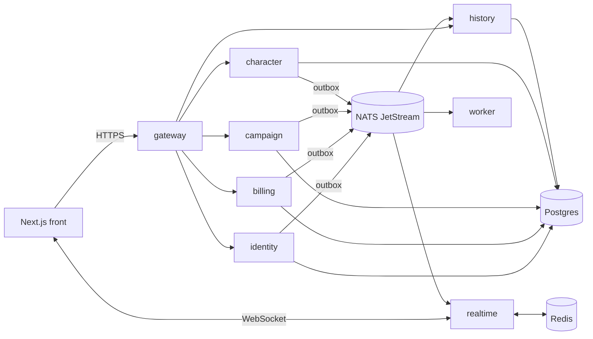

# VTT-DD — Migration Firebase → microservices Node/Postgres

Sep 25, 2026 · @Theo Morin

On réécrit l'application domaine par domaine sur une base neuve : une API Gateway Node, un service par domaine avec son schéma Postgres, un nouveau front Next, et un journal d'événements qui sert aussi d'historique complet. Seul le cœur sain de l'ancienne app est repris (moteur de règles, systèmes de jeu, composants d'UI) ; le reste sert de référence fonctionnelle. Les données et les comptes existants sont migrés : chacun se reconnecte avec son mot de passe actuel et retrouve ses personnages.

> **Changement de stratégie (25 sept. 2026).** Le plan initial était un « strangler » : isoler Firebase dans l'ancien front (phase 1), puis basculer chaque domaine avec écriture double et feature flags pour garder la prod en ligne. Sans utilisateurs actifs et avec ~115 000 lignes de code mêlant UI et accès Firebase, ce plan faisait réécrire ce code deux fois (une fois sur Firebase, une fois sur l'API). On reconstruit donc directement sur la cible. Le travail déjà fait sur l'ancien front (session partagée, cache des profils publics, correctifs SSRF) reste valable et sert de modèle au nouveau.

## État des lieux (commit 68c95a9)

Firebase est partout : 156 fichiers sur \~140 000 lignes TS/TSX l'importent. Le vrai coût de sortie n'est pas le CRUD, c'est le temps réel (43 fichiers avec `onSnapshot`, 52 avec Realtime Database) et les règles de sécurité qui vivent dans `firestore.rules` au lieu d'un backend.

| Brique Firebase        | Usage mesuré                                                                                                                     | Remplaçant                                         |
| ---------------------- | -------------------------------------------------------------------------------------------------------------------------------- | -------------------------------------------------- |
| Firestore              | 22 collections ; `cartes/*` = 415 références (characters 211, cities 39, combat 22, objects 24, settings 27, fog 18, lights 13…) | Postgres, un schéma par service                    |
| Firestore `onSnapshot` | 43 fichiers                                                                                                                      | WebSocket via le service realtime                  |
| Realtime Database      | 52 fichiers : `rooms/:id/cursors`, `positions`, `bubbles`, `drawings`, `obstacles`, `notes`                                      | Redis pub/sub + WebSocket (état éphémère)          |
| Auth                   | email/mot de passe + Google (popup), `verifyIdToken` côté API ; Discord à part                                                   | Service auth maison (JWT + refresh) ou Better Auth |
| Storage                | 14 fichiers, alors que R2 est déjà en place pour les assets                                                                      | Tout sur R2 via URLs présignées                    |
| Rules                  | `firestore.rules` : droits MJ/joueur/propriétaire du perso                                                                       | Autorisation dans chaque service (policies)        |

Points de dette à régler au passage :

- Trois collections pour la même notion : `Salle`, `salles`, `rooms`.
- Le rôle est porté par `users.perso == "MJ"` et `users.room_id` : un utilisateur ne peut être que dans une salle. En Postgres ça devient une table `room_members(room_id, user_id, role)`.
- Fichiers géants : `[roomid]/map/page.tsx` (4 176 lignes), `MJcombat.tsx` (2 160), `fiche.tsx` (2 255). L'accès Firebase y est mélangé à l'UI : il faut d'abord l'extraire dans une couche d'accès.
- 38 routes `/api/*` dans Next (Stripe, Discord, LiveKit, IA, e-mails, crons Vercel) : elles migreront vers les services.
- Le hook husky `pre-commit` lance les tests e2e sur l'émulateur Firebase à chaque commit : trop lent, à déplacer en CI.

## Architecture cible

Sept services Node/TypeScript derrière une gateway, un seul cluster Postgres avec un schéma par service, et un bus d'événements (NATS JetStream) qui alimente à la fois l'historique et le temps réel.



| Service   | Responsabilité                                                                                                                     | Reprend de Firebase / Next                                                                                   |
| --------- | ---------------------------------------------------------------------------------------------------------------------------------- | ------------------------------------------------------------------------------------------------------------ |
| gateway   | Point d'entrée unique : vérif JWT, rate limit, CORS, routage, OpenAPI agrégé                                                       | `api-auth.ts`, les routes `/api/*` exposées                                                                  |
| identity  | Comptes, sessions, OAuth Google + Discord, profils, amis, titres, clés d'API                                                       | Firebase Auth, `users`, `friendships`, `titles`, `/api/login`, `/api/discord/*`                              |
| billing   | Stripe checkout, webhook, portail, factures, droits (plan actif)                                                                   | `/api/checkout`, `/api/stripe-*`, `/api/invoices`, `/api/subscribe`                                          |
| campaign  | Salles, membres et rôles (MJ/joueur), invitations, notes, systèmes de jeu, carte (fog, lumières, objets, villes, portails, combat) | `Salle`/`salles`/`rooms`, `cartes/*`, `Notes`, `SharedNotes`, `requests`, `gameSystems`                      |
| character | Personnages, fiches, inventaire, bonus, compétences, modèles de PNJ/objets, jets de dés                                            | `cartes/*/characters`, `Inventaire`, `Bonus`, `npc_templates`, `object_templates`, `rolls`, `/api/roll-dice` |
| history   | Journal d'actions append-only + requêtes (timeline, filtre par perso, résumé IA)                                                   | `Historique`, `historiqueTrackerService.ts`, `/api/summarize-history`                                        |
| realtime  | WebSocket par salle : diffuse les événements du bus, gère l'éphémère (curseurs, positions en drag, bulles)                         | `onSnapshot`, Realtime Database                                                                              |
| worker    | Asynchrone : e-mails Resend, rappels de session, optimisation d'images, IA (Gemini, DeepL), upload R2 présigné                     | crons Vercel, `/api/send*`, `/api/generate-creature`, Firebase Storage                                       |

Choix techniques :

- **Monorepo pnpm + Turborepo** : `apps/web`, `services/*`, `packages/contracts` (schémas Zod des API et des événements, partagés front/back), `packages/platform` (logger pino, OpenTelemetry déjà présent, config, client NATS).
- **Fastify + Drizzle ORM** : Drizzle sert de requêteur typé ; le schéma, lui, est porté par Liquibase (voir « Migrations »).
- **Migrations Liquibase** : changelogs en SQL formaté, un par service et par schéma (le SQL brut est indispensable pour PostGIS, les partitions de `history.events`, les triggers d'outbox et les `REVOKE`). Exécutées par un Job Kubernetes en hook Argo CD `PreSync`, avec un rôle propriétaire du schéma (`<service>_owner`, DDL) distinct du rôle du service (`<service>_svc`, lecture/écriture des données uniquement) : un service ne peut jamais modifier son propre schéma. Un test CI applique les changelogs sur un PostGIS jetable et vérifie la concordance avec le schéma Drizzle.
- **Paquet `packages/rules`** : le moteur de règles et les systèmes de jeu (aujourd'hui `apps/legacy/src/lib/rules-engine` et `apps/legacy/src/modules`, testés) deviennent un paquet partagé par le front et le service character, qui recalcule les stats dérivées côté serveur.
- **Nouveau front** : une nouvelle app Next dans le monorepo, construite par tranche dans `apps/web` ; l'ancienne app, déplacée dans `apps/legacy`, reste lançable comme référence jusqu'à la parité, puis est supprimée.
- **Sync vs async** : lecture/écriture en REST via la gateway ; tout effet de bord inter-services passe par un événement, jamais par un appel direct service → service.
- **Carte dans campaign** : `cartes` est le cœur (415 références) et vit toujours avec la salle ; la séparer ferait un service très bavard avec campaign. On pourra l'extraire plus tard si elle grossit.

Garde-fou : pour un projet solo ou petite équipe, 8 déploiements (gateway incluse) à maintenir. Un cluster Postgres unique (un schéma et un rôle SQL par service, aucun accès croisé) garde l'isolation sans multiplier les bases.

### Socle applicatif commun (`@vtt/platform`)

Chaque service démarre avec `createService()`, qui branche la même chaîne de middlewares dans le même ordre. Un service n'écrit que ses routes.

| Brique              | Ce qu'elle fait                                                                                                                                                                                                    |
| ------------------- | ------------------------------------------------------------------------------------------------------------------------------------------------------------------------------------------------------------------ |
| Contexte de requête | `x-request-id` (par saut), `x-correlation-id` (suit l'action jusqu'au bus), `x-trace-id` renvoyé au client ; accessible partout via AsyncLocalStorage                                                              |
| Sécurité            | helmet (CSP stricte), CORS en liste blanche, rate limit par IP partagé via Valkey, under-pressure (503 si la boucle sature)                                                                                        |
| Auth                | JWT asymétrique vérifié via le JWKS d'identity (issuer, audience, expiration), `authenticate` et `requireRoomRole('gm')`                                                                                           |
| Idempotence         | En-tête `Idempotency-Key` : une requête rejouée renvoie la réponse d'origine (paiements, jets de dés)                                                                                                              |
| Erreurs             | RFC 9457 `problem+json` ; les 5xx ne divulguent jamais le message interne, qui part dans les logs                                                                                                                  |
| Validation          | Schémas Zod sur params, body et réponses ; OpenAPI généré sur `/openapi.json`                                                                                                                                      |
| Cache               | Cache-aside Valkey : anti-ruée (un seul appel à la source par clé), TTL avec jitter, invalidation par tag (`room:<id>`) déclenchée par les événements, verrou distribué ; si Valkey tombe, on sert depuis Postgres |
| Logs                | pino JSON, secrets masqués (Authorization, cookies, mots de passe, jetons), `trace_id`/`span_id` sur chaque ligne → Loki                                                                                           |
| Traces et métriques | OpenTelemetry (http, fastify, pg, ioredis) en OTLP → Tempo et Prometheus ; `traceparent` copié dans chaque événement pour suivre une action du clic jusqu'à l'historique                                           |
| Sondes et arrêt     | `/healthz`, `/readyz` (dépendances), SIGTERM : readyz passe à 503, drainage, fermeture propre                                                                                                                      |

### Déploiement sur le cluster k3s

Tout tourne sur ton cluster k3s : front Next, services, Postgres, bus, Redis et outillage. Argo CD synchronise le cluster depuis un dépôt GitOps. On ajoute des nœuds (`k3s agent` + join token) quand la charge l'exige.

| Namespace                 | Composants                                                                                        | Outil                                                    |
| ------------------------- | ------------------------------------------------------------------------------------------------- | -------------------------------------------------------- |
| `vtt-prod`, `vtt-staging` | web (Next standalone), gateway, identity, billing, campaign, character, history, realtime, worker | Helm chart commun `charts/service` + valeurs par service |
| `data`                    | Postgres HA (1 primaire + réplicas), sauvegardes et PITR vers R2                                  | CloudNativePG + Barman Cloud                             |
| `messaging`               | NATS JetStream (3 réplicas dès 3 nœuds), Valkey/Redis                                             | Charts officiels                                         |
| `ingress`                 | Traefik (fourni par k3s), TLS Let's Encrypt, WebSocket pour realtime                              | cert-manager                                             |
| `argocd`                  | GitOps, un `ApplicationSet` par environnement                                                     | Argo CD                                                  |
| `security`                | Vérification des signatures cosign à l'admission, politiques Pod Security `restricted`            | Kyverno                                                  |
| `observability`           | Métriques, logs, traces, alertes                                                                  | kube-prometheus-stack, Loki, Tempo, Grafana              |

- **Isolation** : NetworkPolicy « tout refuser » par défaut ; seule la gateway reçoit l'ingress API, et chaque service n'atteint que Postgres, NATS et Redis.
- **Scalabilité** : HPA sur realtime, gateway et worker ; PodDisruptionBudget et `topologySpreadConstraints` pour répartir les réplicas quand il y a plusieurs nœuds.
- **Stockage** : `local-path` (fourni par k3s) suffit pour Postgres et NATS, qui répliquent eux-mêmes. Longhorn seulement si un autre composant a besoin de volumes répliqués.
- **Crons** : les crons Vercel deviennent des `CronJob` Kubernetes (rappel de session, optimisation d'images).
- **Assets** : R2 reste le stockage des images et sons (sortie gratuite, CDN) ; MinIO seulement en local.
- **Limite à connaître** : avec un seul nœud serveur, il n'y a pas de haute disponibilité. Il faut 3 nœuds serveurs (etcd embarqué) pour que le control plane survive à une panne. Les sauvegardes CNPG vers R2 ne dépendent pas du cluster.

## Le tunnel d'historique

Chaque changement d'état devient un événement écrit dans la même transaction que la donnée (transactional outbox), publié sur NATS JetStream, puis stocké en append-only par history. Aucune action ne peut modifier l'état sans laisser de trace, contrairement à `logHistoryEvent` aujourd'hui, appelé à la main et qui échoue en silence (`console.error`).

1. Le service métier fait `UPDATE characters …` **et** `INSERT INTO outbox …` dans une seule transaction.
2. Un relais (dans chaque service) publie les lignes d'outbox sur `vtt.<roomId>.<domaine>.<type>` puis les marque publiées. Livraison au moins une fois.
3. history consomme en durable, dédoublonne par `event_id`, et insère dans `history.events`.
4. realtime consomme les mêmes sujets et pousse aux clients de la salle : l'historique et le live sont le même flux.

Enveloppe commune (schéma Zod dans `packages/contracts`, versionné) :

```json
{
  "id": "0192...uuidv7",
  "type": "character.hp_changed",
  "version": 1,
  "occurredAt": "2026-09-25T14:21:00Z",
  "roomId": "...",
  "actor": { "userId": "...", "role": "gm", "characterId": null },
  "aggregate": { "type": "character", "id": "..." },
  "visibility": "public",
  "payload": { "before": { "hp": 24 }, "after": { "hp": 17 }, "cause": "roll:0192..." },
  "correlationId": "...",
  "traceId": "..."
}
```

Stockage :

```sql
CREATE TABLE history.events (
  id            uuid        NOT NULL,
  occurred_at   timestamptz NOT NULL,
  room_id       uuid,
  type          text        NOT NULL,
  actor_id      uuid,
  aggregate_type text, aggregate_id uuid,
  visibility    text        NOT NULL DEFAULT 'public',
  payload       jsonb       NOT NULL,
  prev_hash     bytea, hash bytea NOT NULL,
  PRIMARY KEY (id, occurred_at)
) PARTITION BY RANGE (occurred_at);
CREATE INDEX ON history.events (room_id, occurred_at DESC);
CREATE INDEX ON history.events (aggregate_type, aggregate_id, occurred_at DESC);
-- rôle du service : INSERT + SELECT uniquement
REVOKE UPDATE, DELETE, TRUNCATE ON history.events FROM history_svc;
```

Règles :

- **Append-only vérifiable** : pas de droit UPDATE/DELETE, et un chaînage de hash par salle (`hash = sha256(prev_hash || event)`) rend toute altération détectable.
- **Visibilité** : `public`, `gm_only` (jets secrets, PNJ cachés), `owner` ; filtrée côté history et realtime, en reprenant la logique de `visibility.ts`.
- **Haute fréquence** : un drag de token n'émet qu'un `token.moved` final (from/to), pas chaque position ; les positions intermédiaires restent dans realtime/Redis.
- **Rétention** : 7 jours dans JetStream (rejeu en cas de panne), indéfini en Postgres, partitions de plus de 12 mois exportées vers R2 si besoin.
- **Usages** : timeline de partie, filtre par perso, annuler/refaire, résumé IA de session, audit (qui a modifié quoi).

## Temps réel

Le service realtime (Socket.IO + adaptateur Redis) remplace à la fois `onSnapshot` et Realtime Database, avec deux canaux par salle : un canal durable nourri par le bus, un canal éphémère qui ne touche jamais Postgres.

| Canal    | Contenu                                                  | Source                        | Garantie                                     |
| -------- | -------------------------------------------------------- | ----------------------------- | -------------------------------------------- |
| Durable  | Tokens posés, PV, inventaire, fog, combat, notes, jets   | Événements JetStream          | Numéro de séquence ; rejeu après reconnexion |
| Éphémère | Curseurs, token en cours de drag, bulles, tracé en cours | Clients → Redis pub/sub (TTL) | Best effort, dernier état gagne              |

Côté front :

- Chargement initial en REST (snapshot + `seq`), puis application des événements reçus ; à la reconnexion, le client envoie son dernier `seq` et reçoit le delta.
- TanStack Query pour le cache ; un événement WS patche ou invalide la clé concernée. Mises à jour optimistes pour le drag et les PV.
- Handshake WS authentifié par le JWT ; l'abonnement à une salle vérifie l'appartenance auprès de campaign (mis en cache Redis) et applique la visibilité `gm_only`.
- Le nouveau front n'accède aux données que par des hooks de domaine (`useRoomCharacters`, `useCursors`…) : aucun composant ne parle directement à l'API ni au WebSocket. C'est le modèle déjà posé dans l'ancien front avec `useSession` et `usePublicProfile`.

### Côté base : ce qui alimente le WebSocket

Postgres ne pousse pas directement vers les navigateurs : `NOTIFY` limite le message à 8 000 octets, ne se rejoue pas après une coupure et ne passe pas par PgBouncer. Il sert donc de sonnette.

1. Le service écrit la donnée et la ligne d'`outbox` dans la même transaction.
2. Un trigger fait `pg_notify('<schéma>_outbox', id)` ; le relais du service (connexion directe, hors PgBouncer) se réveille aussitôt, lit par lots en `FOR UPDATE SKIP LOCKED` et publie sur NATS. Relecture toutes les 5 s en filet de sécurité.
3. history attribue un `seq` par salle ; realtime diffuse avec ce `seq`, et un client qui se reconnecte demande tout ce qui suit son dernier `seq`.

`wal_level=logical` est activé dès maintenant : si un jour l'outbox ne suffit plus, on pourra passer en CDC (pgoutput/Debezium) sans migration de la base.

### PostGIS pour la carte

Les couches de la carte passent en géométries PostGIS (SRID 0, coordonnées en pixels) avec index GiST `(map_id, geom)`. Ce qui se calcule aujourd'hui côté client dans `visibility.ts` devient une requête indexée.

| Couche                                                         | Géométrie         | Requête type                                                               |
| -------------------------------------------------------------- | ----------------- | -------------------------------------------------------------------------- |
| Tokens                                                         | Point             | Qui est dans mon rayon de vision : `ST_DWithin`                            |
| Murs, portes, fenêtres                                         | LineString        | Ligne de vue bloquée : `ST_Intersects` avec le segment observateur → cible |
| Lumières, zones musicales, brouillard révélé, villes, portails | Polygon ou cercle | Zone sous le token après déplacement : `ST_Contains`                       |
| Toutes                                                         | —                 | Ne charger que le viewport : `geom && ST_MakeEnvelope(...)`                |

La visibilité `gm_only` et le brouillard sont appliqués côté serveur avant l'envoi WebSocket : un joueur ne reçoit jamais les tokens cachés, au lieu de dépendre d'un filtrage dans le navigateur. Testé : le plan d'exécution utilise bien l'index GiST.

## Données

Relationnel pour ce qui est stable (comptes, salles, membres, abonnements), `jsonb` pour ce qui dépend du système de jeu (fiche, stats, compétences), avec colonnes générées indexées sur les champs chauds.

| Schéma         | Tables principales                                                                                                                                                                           |
| -------------- | -------------------------------------------------------------------------------------------------------------------------------------------------------------------------------------------- |
| identity       | `users`, `credentials` (hash argon2id), `oauth_accounts` (google, discord), `sessions`, `friendships`, `api_keys`, `user_titles`                                                             |
| billing        | `customers` (stripe\_customer\_id), `subscriptions`, `invoices`, `entitlements`, `stripe_events` (idempotence du webhook)                                                                    |
| campaign       | `rooms`, `room_members (room_id, user_id, role)`, `invitations`, `notes`, `game_systems`, `maps`, `map_layers` (fog, lights, objects, cities, portals, music\_zones, drawings), `encounters` |
| character      | `characters` (sheet jsonb), `inventory_items`, `bonuses`, `skills`, `npc_templates`, `object_templates`, `rolls`                                                                             |
| history        | `events` (partitionnée), `projections` (résumés, compteurs)                                                                                                                                  |
| chaque service | `outbox`, `inbox` (dédoublonnage des événements consommés)                                                                                                                                   |

Migration des données Firestore :

1. Script d'export avec `firebase-admin` (déjà en dépendance) → NDJSON par collection, sous-collections `cartes/*` incluses.
2. Transformation typée (Zod) : IDs Firestore → UUID avec table `legacy_ids`, fusion de `Salle`/`salles`/`rooms`, `users.room_id` + `perso` → `room_members`.
3. Chargement par `COPY`, puis vérification des comptes (lignes et échantillons) en CI sur une copie anonymisée.
4. Comptes : `firebase auth:export` fournit les hash scrypt Firebase et leurs paramètres (clé de signature, séparateur de sel, rounds, coût mémoire, dans la console Firebase). À la première connexion, identity vérifie le mot de passe contre ce hash, puis le re-hashe en argon2id. Personne n'a à réinitialiser son mot de passe ni à recréer de compte ; les comptes Google se relient par e-mail vérifié.
5. `Historique/*/events` est importé dans `history.events` avec `type = legacy.<type>` pour garder l'historique existant.
6. Chaque ancien identifiant Firebase (uid, id de salle, de personnage…) est conservé dans `legacy_ids` de son service : les imports suivants s'en servent pour rattacher chaque personnage, salle et événement d'historique à son propriétaire.

### Sauvegardes

Deux niveaux indépendants, avec un test de restauration automatique : une sauvegarde jamais restaurée ne compte pas.

| Niveau                                 | Contenu                                                                                                | Destination                                                 | Fréquence                 | Rétention |
| -------------------------------------- | ------------------------------------------------------------------------------------------------------ | ----------------------------------------------------------- | ------------------------- | --------- |
| Physique continu (CNPG + Barman Cloud) | Base complète + WAL, restauration à la seconde (PITR)                                                  | Bucket R2 `vtt-pg-backups`                                  | Continu + complet à 3 h   | 30 jours  |
| Logique (`pg_dump` par schéma)         | Un fichier par service, vérifié (`pg_restore --list`, SHA256), chiffré côté client (rclone crypt)      | Autre bucket R2, autres identifiants, verrouillage d'objets | 3 h 30, depuis un réplica | 30 jours  |
| Test de restauration                   | PITR dans un cluster jetable, contrôle des schémas, de PostGIS et de la chaîne de hash de l'historique | —                                                           | Dimanche 6 h              | —         |

Valkey et NATS ne sont pas sauvegardés : le cache se reconstruit, les événements sont déjà dans `history.events`. Le runbook est dans `infra/cluster/backup/RESTORE.md`. La clé de chiffrement des dumps doit aussi être rangée hors du cluster.

## CI/CD et DevSecOps

GitHub Actions, uniquement sur ce qui a changé (`turbo --filter=...[origin/main]`), images signées et déploiement GitOps : une PR ne peut pas fusionner sans tests verts ni scan de sécurité propre, et la prod ne reçoit que des images signées.

| Étape          | Quand                         | Contenu                                                                                                                                                                     | Bloquant             |
| -------------- | ----------------------------- | --------------------------------------------------------------------------------------------------------------------------------------------------------------------------- | -------------------- |
| Qualité        | PR                            | ESLint, `tsc --noEmit`, Prettier, commitlint (déjà en place)                                                                                                                | Oui                  |
| Tests          | PR                            | Vitest unitaires ; intégration avec Testcontainers (Postgres, NATS, Redis) ; tests de contrat sur les schémas d'événements                                                  | Oui                  |
| Migrations     | PR                            | `liquibase validate` puis `update` sur un PostGIS jetable, `rollback` testé, concordance avec le schéma Drizzle ; changements destructifs interdits hors étape « contract » | Oui                  |
| Sécurité code  | PR                            | gitleaks (secrets), Semgrep ou CodeQL (SAST), `dependency-review-action`, OSV-Scanner                                                                                       | Oui si High/Critical |
| Build          | PR + main                     | Dockerfile multi-stage, image distroless, utilisateur non-root, `--read-only`                                                                                               | Oui                  |
| Sécurité image | PR + main                     | Trivy (CVE + misconfig), SBOM Syft, licences                                                                                                                                | Oui si Critical      |
| E2E            | PR                            | Playwright sur la stack complète en docker compose (les tests Playwright existants)                                                                                         | Oui                  |
| Publication    | main                          | Push GHCR par digest, signature cosign keyless (OIDC), attestation de provenance SLSA                                                                                       | —                    |
| Staging        | main                          | Job de migration, puis mise à jour du dépôt GitOps ; smoke tests                                                                                                            | Auto                 |
| Prod           | tag `vX.Y.Z` (release-please) | Environnement GitHub avec approbation manuelle, vérification de signature à l'admission                                                                                     | Manuel               |

Règles transverses :

- **Secrets** : plus aucune clé longue durée dans GitHub ; la CI pousse sur GHCR et modifie le dépôt GitOps, elle ne parle jamais au cluster (Argo CD tire) ; secrets applicatifs chiffrés dans Git avec SOPS (age) déchiffrés par Argo CD, ou Sealed Secrets. Le `FIREBASE_SERVICE_ACCOUNT_KEY` disparaît.
- **Dépendances** : Renovate avec regroupement et automerge des patchs testés.
- **Branches** : `main` protégée, PR obligatoire, checks requis, CODEOWNERS par service.
- **Hooks locaux** : husky ne garde que lint-staged + commitlint ; les e2e sortent du `pre-commit` et partent en CI.
- **Workflows durcis** : actions épinglées par SHA, `permissions:` minimales par job, `step-security/harden-runner`.
- **Observabilité** : l'OpenTelemetry déjà présent est étendu à tous les services → Grafana (Tempo, Loki, Prometheus) ; le `traceId` est aussi dans chaque événement d'historique.
- **Dev local** : `docker compose up` lance Postgres, NATS, Redis, MinIO (à la place de R2) et Mailpit ; plus besoin de l'émulateur Firebase.

## Plan de migration

Reconstruction par tranches verticales : chaque tranche livre un service, ses écrans dans le nouveau front et l'import de ses données, utilisable de bout en bout. L'ancienne app reste lançable comme référence jusqu'à la parité.

| Tranche                     | Contenu                                                                                                                                                                                                                                                                                                                      | Critère de sortie                                                                |
| --------------------------- | ---------------------------------------------------------------------------------------------------------------------------------------------------------------------------------------------------------------------------------------------------------------------------------------------------------------------------- | -------------------------------------------------------------------------------- |
| 0. Fondations               | Monorepo (`apps/web`, `services/*`, `packages/*`), docker compose, pipeline CI de base, `packages/contracts`, `packages/platform`                                                                                                                                                                                            | **Fait**                                                                         |
| 0 bis. Nettoyage            | Retrait de Vercel (crons en `CronJob`), correctifs SSRF, session partagée dans l'ancien front                                                                                                                                                                                                                                | **Fait**                                                                         |
| 1. Socle données + identity | Liquibase (rôles `_owner`/`_svc`, Job PreSync, CI), service identity (e-mail/mot de passe, Google, Discord, JWT EdDSA + JWKS, refresh tokens à rotation, argon2id), import des comptes Firebase avec vérification des hash scrypt à la première connexion, gateway branchée ; nouveau front : connexion, inscription, profil | Un compte existant se connecte avec son mot de passe actuel sur le nouveau front |
| 2. packages/rules           | Moteur de règles et systèmes de jeu extraits d'`apps/legacy` avec leurs tests                                                                                                                                                                                                                                                | Tests verts dans le paquet, `apps/web` l'importe                                 |
| 3. campaign                 | Salles, membres et rôles (`room_members`), invitations, systèmes de jeu d'une salle ; import de `Salle`/`salles`/`rooms` fusionnées                                                                                                                                                                                          | Créer, rejoindre et administrer une salle sur le nouveau front                   |
| 4. character                | Personnages, fiches, inventaire, bonus, compétences, modèles, jets de dés (stats recalculées côté serveur via `packages/rules`) ; import rattaché aux comptes via `legacy_ids`                                                                                                                                               | Chaque joueur retrouve ses personnages                                           |
| 5. Bus + history            | NATS, outbox, service history, import de `Historique`                                                                                                                                                                                                                                                                        | Timeline servie par history, chaîne de hash vérifiée                             |
| 6. realtime + carte         | WebSocket durable/éphémère, carte PostGIS (fog, lumières, murs, villes, portails), combat                                                                                                                                                                                                                                    | Une partie complète jouable sur le nouveau front                                 |
| 7. billing + worker         | Stripe (webhook idempotent), e-mails, IA, optimisation d'images, stockage R2                                                                                                                                                                                                                                                 | Paiement et e-mails fonctionnels                                                 |
| 8. Bascule                  | Import final des données, DNS vers le nouveau front, suppression d'`apps/legacy`, de Firebase et de ses variables                                                                                                                                                                                                            | `firebase` absent du lockfile, projet Firebase supprimé                          |

La carte (tranche 6) reste la plus lourde : `map/page.tsx` (4 183 lignes) et les hooks `useCanvas*` servent de référence fonctionnelle, pas de base de code.

## Décisions

| Question            | Décision                                                                                                                                      | Alternative écartée                                      |
| ------------------- | --------------------------------------------------------------------------------------------------------------------------------------------- | -------------------------------------------------------- |
| Stratégie           | **Décidé** : réécriture par tranches sur la cible, reprise du cœur sain (règles, systèmes de jeu, UI)                                         | Strangler avec isolation de Firebase dans l'ancien front |
| Front               | **Décidé** : nouvelle app `apps/web` à côté de l'ancienne (`apps/legacy`), supprimée à la parité                                              | Réécriture dans `apps/web`                               |
| Données             | **Décidé** : tout migrer (comptes avec leurs mots de passe, salles, personnages, historique)                                                  | Repartir d'une base vide                                 |
| Hébergement         | **Décidé** : tout sur le cluster k3s (front, back, données, outillage), Argo CD, nœuds ajoutés au besoin                                      | —                                                        |
| Postgres            | **Décidé** : CloudNativePG dans le cluster, sauvegardes et PITR vers R2                                                                       | Postgres managé hors cluster                             |
| Migrations          | **Décidé** : Liquibase (SQL formaté, Job PreSync, rôles DDL/DML séparés), Drizzle comme requêteur                                             | Migrations Drizzle (`drizzle-kit`)                       |
| Authentification    | **Décidé** : faite main dans identity — JWT EdDSA publié en JWKS, refresh tokens opaques à rotation avec détection de réutilisation, argon2id | Better Auth ; Keycloak (lourd)                           |
| Bus d'événements    | NATS JetStream : léger, rejeu, un seul binaire                                                                                                | Redis Streams ; Kafka (surdimensionné)                   |
| Staging et prod     | Deux namespaces sur le même cluster au départ                                                                                                 | Cluster de staging séparé plus tard                      |
| Topologie des nœuds | Passer à 3 nœuds serveurs avant d'ouvrir la prod au public                                                                                    | 1 serveur + agents, sans HA du control plane             |

- [x] Choisir l'hébergement backend
- [x] Valider le découpage à 7 services (carte dans campaign)
- [x] Tranche 0 : monorepo + CI
- [x] Tranche 0 bis : nettoyage Vercel, SSRF, session partagée
- [ ] Tranche 1 : socle données + identity
- [ ] Mentions légales : nouvel hébergeur (à la fin)
